# 옆집 컴공생 (NextDoor CS)


**배포 링크:** https://nextdoor-cs.vercel.app

> "수리기사 부르기 전, 옆집 컴공생에게 먼저 물어보세요!"

AI 기반 PC 하드웨어 진단 PWA입니다. 스마트폰 카메라·마이크 입력을 OpenCV.js로 선별하고, Gemini Vision이 사용자에게 다음 조치를 안내합니다.

---

## 한 줄로 보면

이 프로젝트는 "사진을 Gemini에 보내는 앱"이 아니라, **OpenCV가 카메라 입력을 분석 가능한 프레임으로 게이팅하고, BIOS 화면 구조와 텍스트 후보 좌표를 추출해 Gemini의 판단 범위를 제한하는 컴퓨터 비전 파이프라인**입니다. Gemini는 "어느 후보가 다음 조작 대상인가"를 고르는 의미 판단 계층만 담당하고, OpenCV는 그 전/후의 입력 게이팅과 화면 좌표 grounding을 담당합니다.

| 항목 | 결과 |
|---|---:|
| 실촬영 BIOS 22장 품질 게이트 통과 | 8/22 (36.4%) |
| BIOS ROI/corner 후보 검출 | 14/22 (63.6%) |
| 변화 감지 평균 F1 (합성 36조합) | **0.703** |
| 변화 감지 실측 영상 F1 (CORREL+RGB+w=3) | 0.34 / AUC 0.70 |
| 파이프라인 통합 API 호출 절감 | **29회 → 5회 (▼83%)** |
| 추정 비용 절감 | $1.50 → $0.26 /hr |

---

## 🎬 Demo

### 데모 영상 — 윈도우 설치 전 BIOS 진입 시나리오
https://youtu.be/oOzmI5wq_bo?si=dVujNWymE_aA54hQ


### 데모 영상 2 — 비프음 3번, 부팅 불가 시나리오
https://youtube.com/shorts/ui-iWedoapU?si=vh799Z2-139FsLpk


라이브 카메라 가이드 모드 — PC 화면을 스마트폰으로 비추면 단계별 안내와 AR 타깃 오버레이를 실시간으로 받을 수 있습니다.

| 온보딩 | 문제 선택 | 촬영 준비 |
|:---:|:---:|:---:|
|  || 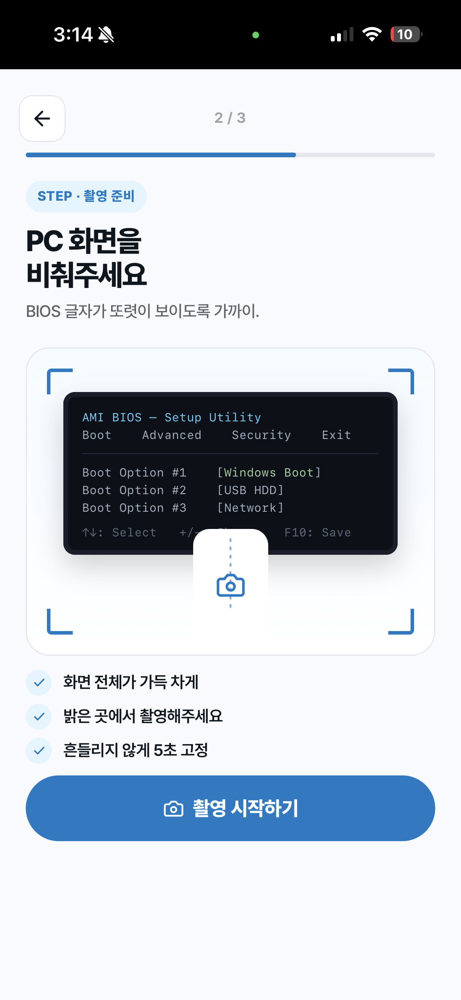 |

| BIOS 화면 인식 | Boot Option #1 안내 | USB 부팅 옵션 안내 |
|:---:|:---:|:---:|
|  |  |  |

<details>
<summary><strong>📸 추가 시나리오 1 — BIOS 부트 순서 변경</strong></summary>

<br>

USB 부팅이나 부팅 우선순위 변경이 필요할 때, PWA 카메라로 BIOS 화면을 비추면서 다음에 눌러야 할 메뉴를 안내받는 흐름입니다. 앱은 카메라 프레임의 품질과 변화 여부를 확인하고, OpenCV 전처리로 화면 영역과 텍스트 후보를 정리한 뒤 Gemini Vision에 전달합니다. Gemini가 `Boot Option #1`, `UEFI USB`, `Save & Exit` 같은 조작 대상을 선택하면, 앱은 해당 위치를 카메라 화면 위에 오버레이로 표시합니다.

단순히 "Boot 메뉴를 누르세요"라는 텍스트가 아니라, 실제 촬영 화면 위에서 어느 항목을 선택해야 하는지 바로 확인할 수 있다는 점이 핵심입니다.

| BIOS Boot 화면 인식 | Boot Option 안내 | Save & Exit 안내 |
|:---:|:---:|:---:|
|  |  |  |

</details>

<details>
<summary><strong>📸 추가 시나리오 2 — RAM 장착 불량 진단</strong></summary>

<br>

전원은 들어오지만 화면이 나오지 않는 상황에서, 사용자가 본체 내부를 촬영하며 RAM 장착 불량 가능성을 확인하고 조치 안내를 받는 흐름입니다. 앱은 증상과 촬영 화면을 바탕으로 RAM 재장착이 필요한 상황인지 판단하고, 사용자가 본체를 열어 RAM 슬롯 주변을 비출 수 있도록 단계별로 안내합니다.

하드웨어 조치가 포함되기 때문에 전원 코드 분리, 잔류 전류 제거, 정전기 방전 같은 안전 체크를 먼저 안내합니다. 이후 RAM 양쪽 클립을 열어 분리하고, 금색 접점을 마른 천이나 접점 세정제로 닦은 뒤, 슬롯에 다시 끝까지 밀어 넣는 과정을 순서대로 보여줍니다. 현장 응급 조치로 지우개를 사용할 수 있는 경우에도 가루가 남지 않도록 완전히 제거해야 한다는 점을 함께 안내합니다.

이 시나리오는 OpenCV가 부품을 직접 분류하지 않고 촬영 품질과 화면 변화 여부만 관리하며, 의미 판단은 Gemini Vision이 담당하는 구조를 보여줍니다.

| 증상 입력 | 입력 없이 카메라 시작 | 라이브 촬영 목표 설정 |
|:---:|:---:|:---:|
| 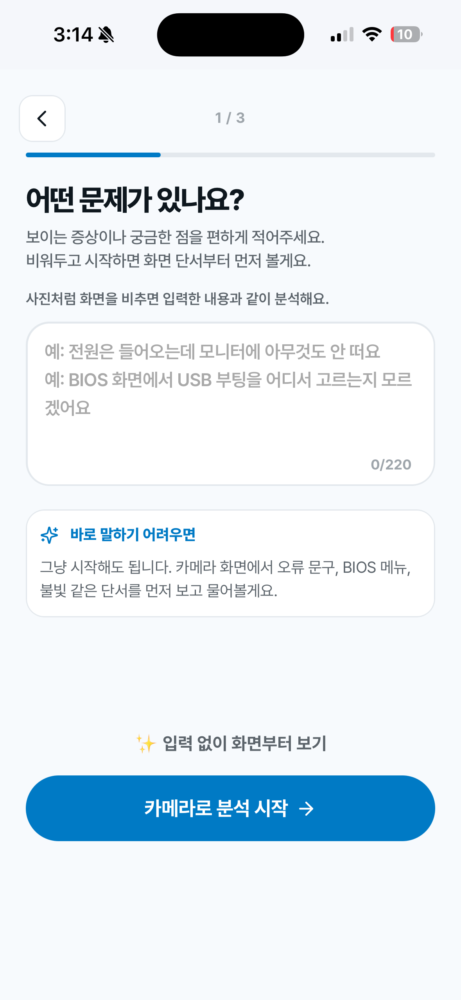 | 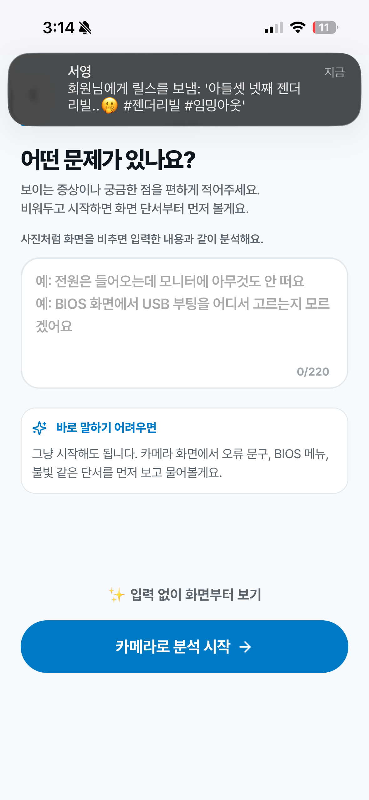 | 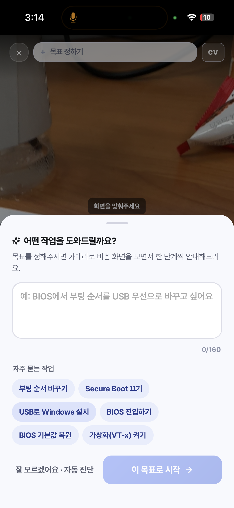 |

</details>

<details>
<summary><strong>📸 PWA 화면 스크린샷 모음</strong></summary>

<br>

| 스플래시 | PWA 홈 | 문제 입력 |
|:---:|:---:|:---:|
|  | 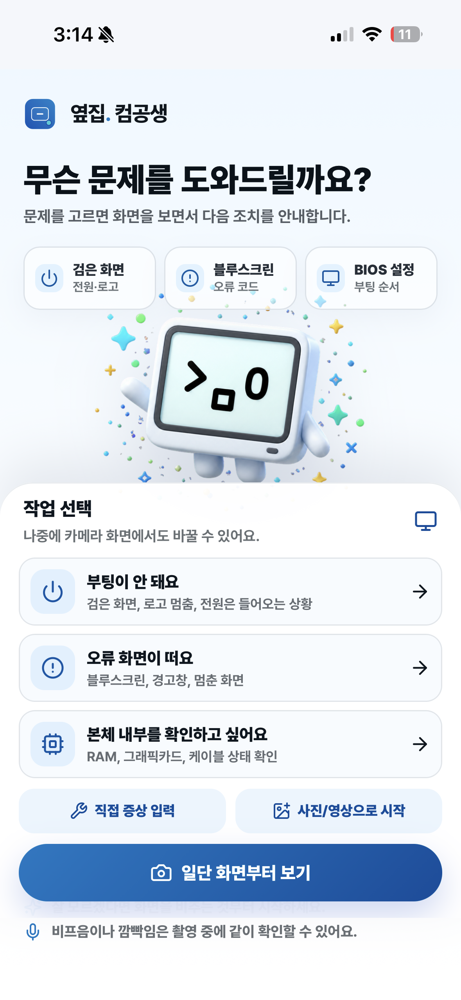 |  |

| 촬영 가이드 | 라이브 카메라 | AR 안내 |
|:---:|:---:|:---:|
|  |  | 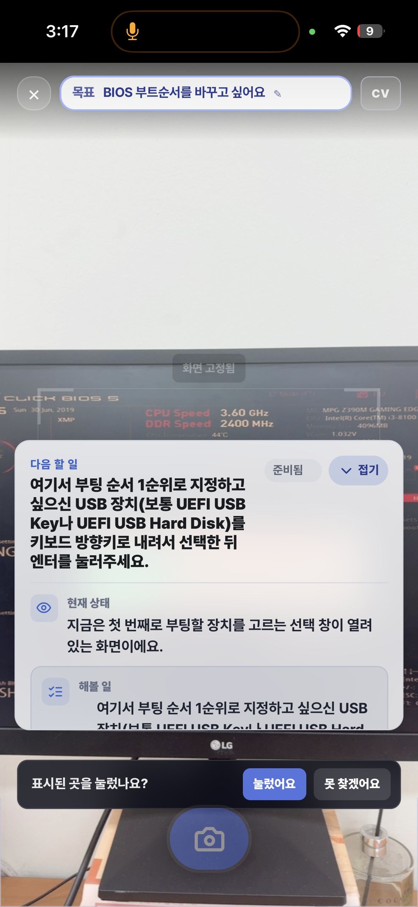 |

</details>

<details>
<summary><strong>🎥 제출 데모 촬영 조건</strong></summary>

<br>

라이브 가이드 데모는 알고리즘이 가장 안정적으로 동작하는 조건에서 촬영합니다. 목적은 "OpenCV가 실시간으로 화면 구조를 잡고 Gemini 안내를 화면 좌표로 연결한다"는 핵심 흐름을 선명하게 보여주는 것입니다.

| 조건 | 권장값 | 이유 |
|---|---|---|
| 촬영 각도 | 정면 또는 좌/우 0~15° | BIOS 외곽선과 텍스트 후보가 가장 안정적으로 검출됨 |
| 화면 점유율 | 프레임의 70% 이상 | 화면 외곽과 메뉴 텍스트가 충분한 픽셀 크기로 들어옴 |
| 밝기/반사 | 반사 적은 일반 밝기 | Laplacian/brightness 품질 게이트와 CC 후보 추출 안정화 |
| 장면 | Boot 탭, Boot Option 팝업, Save & Exit | 정답 메뉴와 AR 타깃이 명확함 |
| 조작 속도 | 메뉴 전환 후 1초 정도 정지 | CV overlay는 약 700ms마다 갱신되고, Gemini 전송은 명시적 캡처/별도 cooldown으로 분리됨 |

스트레스 조건(50° 이상 각도, 강한 반사, iOS 자동 초점 흔들림)은 한계 시연 또는 README 한계 항목에서 다루고, 메인 데모는 위 조건으로 촬영합니다.

</details>

---

## 🎯 프로젝트 소개

### 문제 정의

PC 부팅 불량·BIOS 설정·시스템 오류는 비전문가에게 진입 장벽이 높습니다. 그러나 수리기사를 부르기 전에 스스로 해결 가능한 경우도 많습니다. 문제는 "지금 화면에서 정확히 어떤 메뉴를 눌러야 하는지"가 불분명하다는 것입니다.

### 솔루션

스마트폰 카메라로 PC 화면을 비추면, OpenCV.js가 프레임을 게이팅하고 BIOS 화면 구조를 추출한 뒤, Gemini Vision이 다음 조작 대상을 선택하고, 앱이 그 위치를 AR 오버레이로 표시합니다. 비프음 진단의 경우 마이크 입력으로 BIOS beep code를 기록하고 제조사별 의미를 해석합니다.

---

## 🏗️ 시스템 아키텍처

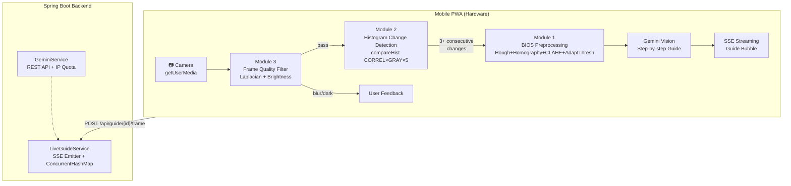
```mermaid
graph TB
    subgraph Mobile_PWA["Mobile PWA (Hardware)"]
        CAM["📷 Camera\ngetUserMedia"]
        M3["Module 3\nFrame Quality Filter\nLaplacian + Brightness"]
        M2["Module 2\nHistogram Change Detection\ncompareHist CORREL×GRAY×5"]
        M1["Module 1\nBIOS Preprocessing\nHough+Homography+CLAHE+AdaptThresh"]
        GV["Gemini Vision\nStep-by-step Guide"]
        SSE["SSE Streaming\nGuide Bubble"]
        CAM --> M3
        M3 -->|"pass"| M2
        M3 -->|"blur/dark"| UF1["User Feedback"]
        M2 -->|"3+ consecutive\nchanges"| M1
        M1 --> GV
        GV --> SSE
    end

    subgraph Backend["Spring Boot Backend"]
        GS["GeminiService\nREST API + IP Quota"]
        LGS["LiveGuideService\nSSE Emitter + ConcurrentHashMap"]
        GS -.-> LGS
    end

    Mobile_PWA -->|"POST /api/guide/{id}/frame"| LGS
```

---

## 🔬 컴퓨터 비전 파이프라인

### 핵심 아이디어 — Gemini는 "무엇을", OpenCV는 "어디에"

Gemini Vision은 화면을 보고 **"Boot Priority를 클릭하세요"**라는 자연어 안내는 할 수 있습니다. 하지만 그 텍스트가 지금 화면 위 **어느 픽셀에 있는지**는 Gemini 단독으로는 알 수 없습니다. 사용자가 여전히 눈으로 찾아서 클릭해야 합니다.

본 프로젝트의 OpenCV 파이프라인은 이 한계를 정확히 해결합니다.

| | Gemini Vision만 사용 | **본 프로젝트 (Gemini + OpenCV)** |
|---|---|---|
| 안내 방식 | "Boot Priority 항목을 클릭하세요" (텍스트만) | 텍스트 안내 + 해당 항목 위치에 AR 박스 표시 |
| 위치 정보 | ❌ 픽셀 좌표 없음 | ✅ OCR bbox → homography 역변환 → 카메라 좌표계 |
| 사용자 행동 | 눈으로 찾아서 클릭 | AR 박스가 가리키는 위치를 클릭 |

**동작 원리는 세 단계입니다:**

1. **OpenCV** `connectedComponentsWithStats`가 BIOS 화면의 각 텍스트 영역을 바운딩 박스와 함께 추출합니다. 예: `{ id: "roi_14", bbox: { x: 0.31, y: 0.44, w: 0.28, h: 0.06 }, text: "Boot Priority" }`
2. **Gemini**는 후보 목록을 받고 "Boot Priority를 클릭하세요" + `targetId: "roi_14"`를 선택합니다.
3. **AR Overlay**는 `targetId`의 bbox를 homography 역변환으로 카메라 원본 좌표계로 복원해 화면 위에 박스를 표시합니다.

Gemini가 **"무엇을"**(의미 판단), OpenCV가 **"어디에"**(픽셀 좌표 그라운딩)를 담당합니다. 이 둘이 결합될 때 비로소 자연어 설명이 실제 화면 위 AR 안내로 연결됩니다.

### 파이프라인 게이트 흐름

세 CV 모듈이 순차 게이트 구조로 동작합니다.

```
카메라 프레임 (RGBA Canvas ImageData)
    ↓
[모듈 3] 프레임 품질 게이트 — cv.Laplacian/meanStdDev + cv.Sobel/threshold + cv.calcHist
    ↓ pass          ↓ reject → "흔들렸어요 / 너무 어두워요"
[모듈 2] 히스토그램 변화 감지 — HISTCMP_CORREL × RGB × 3프레임 연속 (실측 ablation 기반)
    ↓ 변화 감지 (windowSize 연속)
[모듈 1] BIOS 화면 전처리 — Hough → Homography → CLAHE → AdaptiveThreshold → CC
    ↓ 전처리 완료 + cvSummary 메타데이터
Gemini Vision — 이미지 + CV 메타데이터 + OCR/ROI 후보 → 다음 조치 판단
    ↓
overlay target 선택 — targetId 또는 normalized bbox
    ↓
AR Overlay — 클릭/조치할 위치를 화면 위 박스로 표시
    ↓
SSE 스트리밍 → GuideBubble 단계별 안내
```

<details>
<summary><strong>💡 배포 앱에서 OpenCV가 실제로 동작하는 지점</strong></summary>

<br>

배포된 PWA에서 사용자가 라이브 가이드 모드로 들어가면, 카메라 프레임은 바로 Gemini로 전송되지 않습니다. 먼저 브라우저에서 OpenCV.js가 로드되고, 캔버스의 `ImageData`가 아래 순서로 처리됩니다.

| 시점 | 실행되는 CV 처리 | 앱에서 보이는 결과 | 구현 위치 |
|---|---|---|---|
| PWA 진입 | `/opencv.js` WASM 로드 및 ready 상태 관리 | OpenCV 준비 상태에 따라 라이브 분석 활성화 | `src/hooks/useOpenCV.ts` |
| 카메라 프레임 캡처 | RGBA frame을 Canvas `ImageData`로 추출 | 실시간 촬영 프레임 분석 시작 | `src/hooks/useLiveFrameCapture.ts` |
| 품질 검사 | brightness, Laplacian variance, edge density, coverage 계산 | "너무 어두움", "흔들림", "분석 가능" 안내 | `src/lib/cv/frameMetrics.ts` |
| 변화 감지 | GRAY histogram 생성 후 `cv.compareHist` 비교 | 같은 화면 반복 분석 방지 | `src/lib/cv/changeDetection.ts` |
| BIOS 전처리 | Canny/Hough/contour/Homography/CLAHE/Threshold/CC | BIOS ROI, 텍스트 후보, 전처리 이미지 생성 | `src/lib/cv/biosPipeline.ts` |
| 좌표 변환 | homography inverse로 rectified 좌표를 원본 영상 좌표로 복원 | 실제 카메라 화면 위 박스 위치 계산 | `src/lib/cv/biosPipeline.ts` |
| Gemini 호출 | 원본/전처리 이미지 + `cvSummary` + OCR/ROI 후보 전달 | Gemini가 후보 중 다음 조작 대상을 선택 | `src/hooks/useGeminiLiveGuide.ts` |
| AR 표시 | Gemini의 `targetId`/`bbox`를 SVG overlay로 렌더링 | 사용자가 눌러야 할 위치를 카메라 위에 표시 | `src/components/mobile/LiveGuideMode.tsx` |

OpenCV는 백그라운드에서 한 번 실행되는 데모 코드가 아니라, **카메라 프레임 입력 → 품질 판단 → 화면 구조 추출 → 좌표 후보 생성 → AR 오버레이**까지 라이브 가이드 흐름의 앞단을 담당합니다.

</details>

<details>
<summary><strong>📹 진단 클립 캡처 — 길게 누름으로 영상에서 상위 N개 프레임 자동 선별</strong></summary>

<br>

라이브 프레임 모드(매 프레임을 그때그때 게이팅)와 별개로, **카메라 셔터를 길게 누르면(≥ 650 ms) OpenCV가 짧은 영상 클립을 직접 채점해 상위 N개 프레임만 골라 Gemini로 전송하는 진단 모드**가 별도로 동작합니다. 한 장의 정지 사진만으로는 의미가 드러나지 않는 **LED 깜박임, 팬 회전, 부팅 시퀀스, BIOS 화면 전환, 비프음/팬 소음 같은 시간성 신호**를 단일 LLM 호출 비용 안에서 분석하기 위한 모드입니다.

| 단계 | 처리 | 구현 위치 |
|---|---|---|
| 트리거 | 카메라 버튼 long-press 650ms 이상 → 클립 캡처 시작 (`shouldStartDiagnosticClip`) | `src/components/mobile/LiveGuideMode.tsx` |
| 샘플링 | 125ms 간격, 최대 4초까지 프레임 수집 (최대 ~32장) + 마이크 RMS/peak 동시 수집 | `useDiagnosticClipCapture.ts:beginClipCapture` |
| 채점 | 각 프레임에 `analyzeFrame` 실행 → `qualityScore` (Laplacian/brightness 기반) + `sceneChangeScore` (histogram 변화) | `src/lib/cv/frameMetrics.ts` |
| **상위 N 선별** | **quality 상위 3장 + sceneChange 상위 3장 → 중복 제거 후 최대 5장** | `selectDiagnosticFrames()` |
| 대표 프레임 1장 | quality 최고 프레임 1장에만 모듈 1(BIOS 파이프라인) 실행 → OCR/ROI 후보 추출 | `runBiosPipeline()` |
| 정량 요약 | 5장 전체에서 brightness pulse Hz, scene change count, LED blink likely, fan/motion likely 산출 → `cvSummary` 문자열로 Gemini 프롬프트에 포함 | `buildDiagnosticClipSummary()` |
| 모드 분기 | usable=0 + 비프음/노이즈 감지 → `audio-only`, 둘 다 있으면 `hybrid`, 시각만 있으면 `visual` | `classifyDiagnosticClipMode()` |
| 폴백 | 모듈 3 품질 게이트가 모든 프레임을 거부하면 `captureMode='audio-only'`로 전환 후 사용자 피드백 표시 | `LiveGuideMode.tsx` |

핵심 차별점은 **"영상을 통째로 Gemini에 보내지 않는다"**는 것입니다. 4초 동안 수집된 ~32장 중 OpenCV가 두 축(품질/변화)으로 정렬해 **상위 5장 dedup + 그중 대표 1장의 JPEG + 정량 메타데이터**만 LLM 입력으로 사용하므로, LED 깜박임이나 비프음 같은 시간성 신호도 단일 호출 비용 안에서 다룰 수 있습니다.

#### 전송 방식별 비용·지연 비교 (추정)

같은 4초 동영상 단서를 LLM에 전달하는 세 가지 가상 시나리오를 같은 축에서 비교합니다. 실측이 아닌 **API 토큰 산정 규칙과 일반 모바일 환경 기준 추정치**이며, 정확한 토큰·비용은 Gemini 사용량 메타데이터를 수집한 후 보강할 예정입니다.

| 전송 방식 | 업로드 크기 | 이미지 토큰¹ | 텍스트 토큰² | 응답 시간³ | 모바일 적합성 |
|---|---|---|---|---|---|
| 영상 통째 전송 (4초 1080p) | 2~5 MB | ~1,000 (~1 fps 샘플링) | ~200 | 8~15 s | △ |
| 상위 5장 dedup + 요약 | ~250 KB | ~1,300 (258 × 5) | ~250 | 4~8 s | ✅ |
| **대표 1장 + cvSummary (현재 설계)** | **~50 KB** | **~258** | **~250** | **2~5 s** | **✅** |

¹ Gemini 3.5 기준 768×768 미만 이미지는 이미지당 258 토큰 고정. 영상 입력은 약 1 fps 샘플링으로 토큰화된다는 공식 가이드를 토대로 산정. 출처: [Gemini API — Image/Video understanding](https://ai.google.dev/gemini-api/docs/vision).
² `cvSummary` 메타데이터(brightnessPulseHz, sceneChangeCount, ledBlinkLikely, audio peak/rms, captureMode 등)와 OCR 후보 JSON의 대략적 합산.
³ Spring Boot → Gemini → SSE 왕복 합산. 실측 아님 — 모바일 LTE에서의 업로드 시간 + 모델 추론 시간 일반 범위.

이미지 토큰만 보면 차이는 작지만, **업로드 대역폭은 약 40~100배, 응답 시간은 약 2~3배 차이**가 납니다. 모바일 PWA에서 길게 누름 → 즉시 안내가 필요한 UX에서 이 차이가 결정적입니다. 또한 영상 입력은 Gemini가 자체 샘플링으로 정보를 잃는 반면, 본 설계는 **클라이언트 OpenCV가 의도적으로 의미 있는 5장을 골라 통계로 압축**하므로 시간성 신호(깜박임 Hz, 비프음 피크) 자체는 영상 통째 전송보다 오히려 잘 보존됩니다.

##### 실측 토큰 사용량 측정 방법

위 표를 실측값으로 보강하기 위해 Gemini API의 `usageMetadata`를 다음 경로로 수집합니다.

1. **백엔드** — `GeminiService.generateGuideResponseWithUsage()`가 `usageMetadata`를 파싱해 `TokenUsage` 레코드로 반환.
2. **SSE forward** — `LiveGuideService.processFrame()`이 SSE `usage` 이벤트로 `{promptTokens, candidatesTokens, totalTokens, captureSource, context}`를 클라이언트에 push.
3. **백엔드 로그** — 같은 정보를 `[GUIDE-USAGE] context=… captureSource=… promptTokens=… …` 형식으로 SLF4J 로그에 남김.
4. **클라이언트 누적** — `useGeminiLiveGuide`가 `captureSource`별로 호출 횟수와 토큰 합을 누적해 콘솔에 출력. `__nextdoorGuideUsage`로 평균 조회 가능.

`captureSource`는 `clip` (길게 누름 동영상), `photo` (탭 사진), `live` (라이브 프레임 게이트), `galleryVideo` (갤러리 동영상) 4종으로 분리되어 같은 세션의 다른 진입 방식 간 직접 비교가 가능합니다.

</details>

<details>
<summary><strong>📝 Gemini만 쓰지 않은 이유 — 상세 비교</strong></summary>

<br>

이 프로젝트에서 Gemini Vision만 사용하면 전체 이미지를 한 번에 해석할 수는 있지만, 컴퓨터 비전 과제 관점에서는 다음 문제가 남습니다.

| Gemini만 사용할 때의 문제 | OpenCV로 해결한 방식 | 현재 근거 |
|---|---|---|
| 흐림·반사·어두운 프레임도 그대로 API에 들어감 | Laplacian variance와 밝기 통계로 저품질 프레임을 사전 거부 | 실촬영 22장 중 14장 거부 (**63.6%**) |
| 같은 BIOS 화면이 반복 전송되어 비용/지연 증가 | 히스토그램 변화 감지로 의미 있는 화면 전환만 후속 처리 | 모듈 2 전체 F1 **0.703** |
| Vision 모델이 이미지 전체에서 메뉴 위치를 직접 추론 | Canny/Hough/contour로 BIOS 영역과 UI 구조 후보를 좌표화 | 22장 중 14장 ROI 후보 검출 (**63.6%**) |
| "Boot Option" 같은 자연어 안내가 실제 화면 위치와 분리됨 | connected components/OCR bbox를 원본 영상 좌표로 유지 | 평균 텍스트/에지 ROI 후보 **425.1개** |
| 최종 응답이 설명으로 끝나고 사용자가 다시 찾아야 함 | Gemini가 선택한 후보를 AR overlay로 표시 | `targetId` / normalized `bbox` |

세 가지 핵심 이득:

1. **호출 절감** — 품질이 낮거나 변화가 없는 프레임을 걸러 Gemini 호출 후보를 줄임
2. **판단 안정화** — Gemini가 전체 이미지를 처음부터 해석하기보다, OpenCV가 정리한 품질 정보와 후보 영역을 함께 사용
3. **행동 안내 연결** — 최종 응답이 자연어 설명에서 끝나지 않고, 클릭/조치할 위치를 화면 위 박스로 표시

</details>

---

## 🧪 CV 모듈

### 모듈 1 — BIOS 화면 End-to-End 파이프라인 🥇

원본 RGBA 프레임이 Canny → HoughLinesP → 4-corner extraction → Homography → CLAHE → AdaptiveThreshold → ConnectedComponents 순으로 처리되어 OCR/Vision 모델 입력에 적합한 형태로 정리됩니다.

| BIOS 파이프라인 단계 | Threshold 방법 비교 |
|:---:|:---:|
| 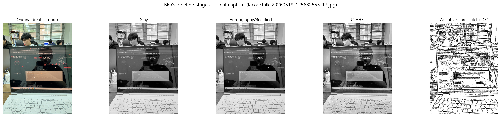 | 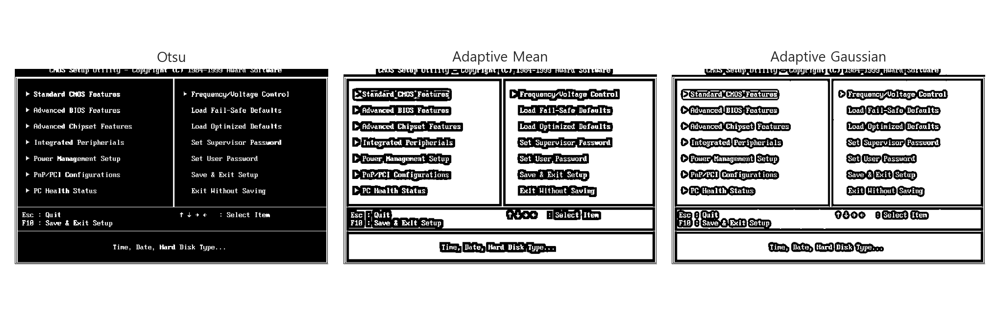 |

같은 실촬영 프레임에서 Otsu는 82개, Adaptive Mean은 267개(주변 키보드·반사 노이즈까지 포착), **Adaptive Gaussian은 130개의 텍스트 ROI 후보**를 분리했습니다. Adaptive Gaussian이 잡음과 신호 사이의 균형이 가장 좋아서 production에서 채택했습니다.

<details>
<summary><strong>알고리즘 파이프라인 (상세)</strong></summary>

<br>

```
원본 RGBA 프레임
  → cvtColor(GRAY)
  → Canny(50, 150)                           — 경계선 추출
  → HoughLinesP(vote=80, minLen=50, gap=10)  — 직선 검출
  → extractQuadCorners()                      — 4 모서리 추정
  → findHomography(RANSAC) + warpPerspective  — 정면화
  → CLAHE(clipLimit=2.0, tileGrid=8)          — 대비 강화
  → adaptiveThreshold(GAUSSIAN_C, block=11, C=2) — 이진화
  → connectedComponentsWithStats              — 텍스트 ROI 계수
  → [전처리 이미지 → Gemini Vision / Tesseract.js]
```

</details>

<details>
<summary><strong>Ablation Study — 단계별 기여도 (실촬영 22장 proxy)</strong></summary>

<br>

로컬 Tesseract가 없는 환경에서는 OCR 점수가 0으로 기록되어 정량 비교 의미가 사라집니다. 대신 같은 22장 실촬영 프레임에 대해 16개 파이프라인 조합을 모두 실행하고, OCR 직전 단계인 **텍스트 ROI 후보 개수**(connected components 중 텍스트 모양 조건을 만족하는 것)를 proxy로 측정했습니다.

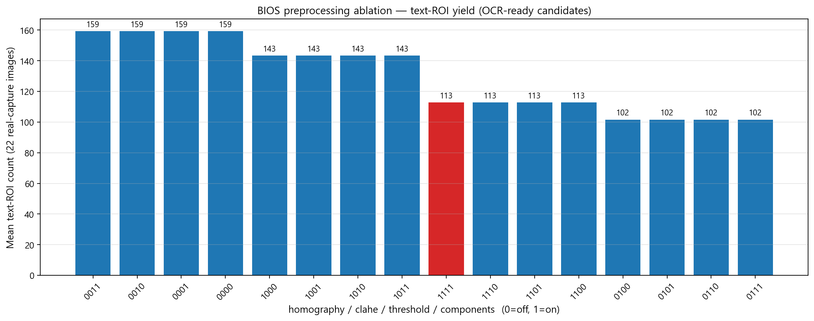

| 단계 조합 (homography/clahe/threshold/components) | 평균 텍스트 ROI 후보 | 해석 |
|---|---:|---|
| `0011` ~ `0000` (homography off) | **159** | 원본 프레임이 그대로 유지되어 가장 많은 후보 생성. 단 환경 노이즈 포함 |
| `1000` ~ `1011` (homography on, CLAHE off) | 143 | 정면화 시 일부 영역이 잘려 후보 감소 |
| **`1111` 전체 파이프라인** | **113** | 정면화 + CLAHE + Threshold + CC 필터 후 가장 신뢰도 높은 후보만 잔존 |
| `0100` ~ `0111` (CLAHE only, no homography) | 102 | CLAHE 후 후속 단계 없으면 후보 응집 부족 |

> 절대 ROI 수가 많다고 좋은 게 아니라, **노이즈가 제거된 신뢰도 높은 후보**가 OCR에 유리합니다. 위 차트는 환경 노이즈(키보드·모니터 반사)를 포함한 22장에서 측정한 값이므로, 전체 파이프라인(`1111`)의 113개가 실제 사용에 가장 적합한 값입니다.

상세 데이터: [`bios-ablation.csv`](docs/ablation-results/bios-ablation.csv) · 재실행: `python notebooks/regenerate_real_bios_charts.py`

</details>

<details>
<summary><strong>OCR 키워드 Recall Ablation (Tesseract 5.4, 실촬영 22장)</strong></summary>

<br>

품질 게이트 통과 8장을 대상으로 전처리 조합별 BIOS 키워드 포함 비율을 측정했습니다. 입력 이미지가 Chrome 브라우저에서 MSI BIOS 사진을 열어 촬영한 스크린샷이므로, GUI BIOS(MSI Click BIOS 5)에서 Tesseract가 갖는 구조적 한계가 수치로 드러납니다.

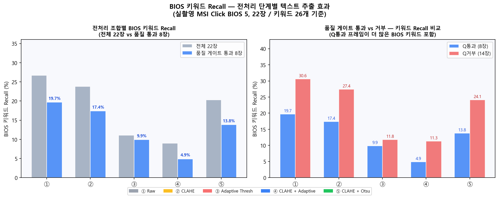

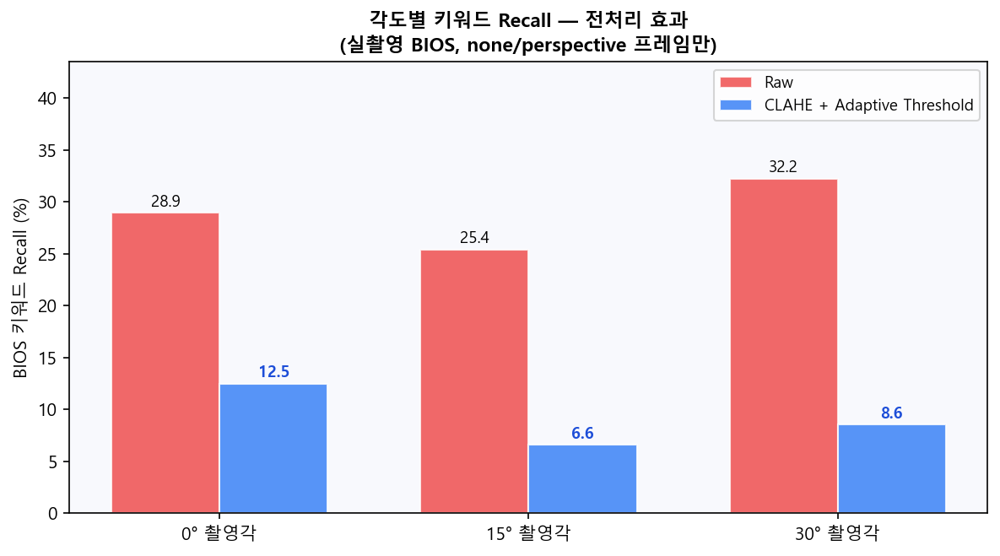

| 전처리 조합 | 전체 KW-Recall | 품질통과(8장) | 품질거부(14장) |
|---|---:|---:|---:|
| ① Raw (없음) | 26.7% | **19.7%** | 30.6% |
| ② CLAHE만 | 23.8% | 17.4% | 27.4% |
| ③ Adaptive Threshold만 | 11.1% | 9.9% | 11.8% |
| ④ CLAHE + Adaptive | 9.0% | 4.9% | 11.3% |
| ⑤ CLAHE + Otsu | 20.3% | 13.8% | 24.1% |

> **핵심 발견**: GUI BIOS(MSI Click BIOS 5)에서 Adaptive Threshold 전처리는 오히려 키워드 Recall을 감소시킵니다(-14.8%p). 이는 그래픽 기반 BIOS UI가 문서 OCR 전제의 Tesseract에 적합하지 않음을 정량으로 보여주며, 텍스트 이해를 Gemini Vision에 위임한 아키텍처 결정의 근거가 됩니다.
> Tesseract는 텍스트 모드 BIOS(AMI/Award/Phoenix POST 화면) 벤더 식별에 한정하여 사용합니다.
> 재실행: `python notebooks/run_ocr_evaluation.py`

</details>

<details>
<summary><strong>Real-Capture BIOS Evaluation (22장 실촬영 정량 결과)</strong></summary>

<br>

MSI Click BIOS 5의 `Boot` 화면과 `Boot Option #1` 팝업을 모니터에 띄운 뒤, 스마트폰으로 22장의 이미지를 촬영했습니다. 스크린샷 대신 실제 촬영 이미지를 사용한 이유는 카메라 기반 진단에서 자주 생기는 반사, 초점 흐림, 화면 외 영역, 부분 crop이 전처리 성능에 직접 영향을 주기 때문입니다.

| 평가 항목 | 포함한 조건 | 사용한 OpenCV 처리 |
|---|---|---|
| 프레임 품질 게이트 | blur / dark / bright / glare / far / shake | Laplacian variance, brightness mean/std |
| BIOS 외곽 검출 | front / left15 / right15 / left30 / right30 / tilt | Canny, HoughLinesP, contour quad 후보 |
| 전처리/OCR | boot-main / boot-popup | CLAHE, Adaptive Gaussian Threshold, OCR similarity |
| 영상 변화 감지 | boot-main → boot-popup | histogram correlation 기반 scene-change gate |

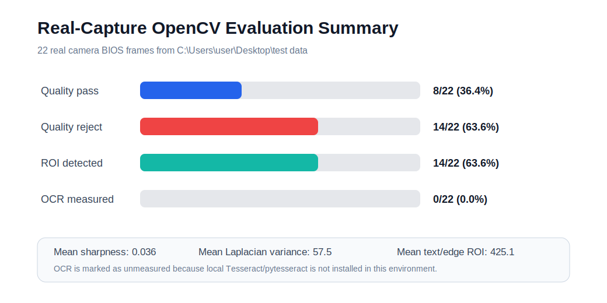

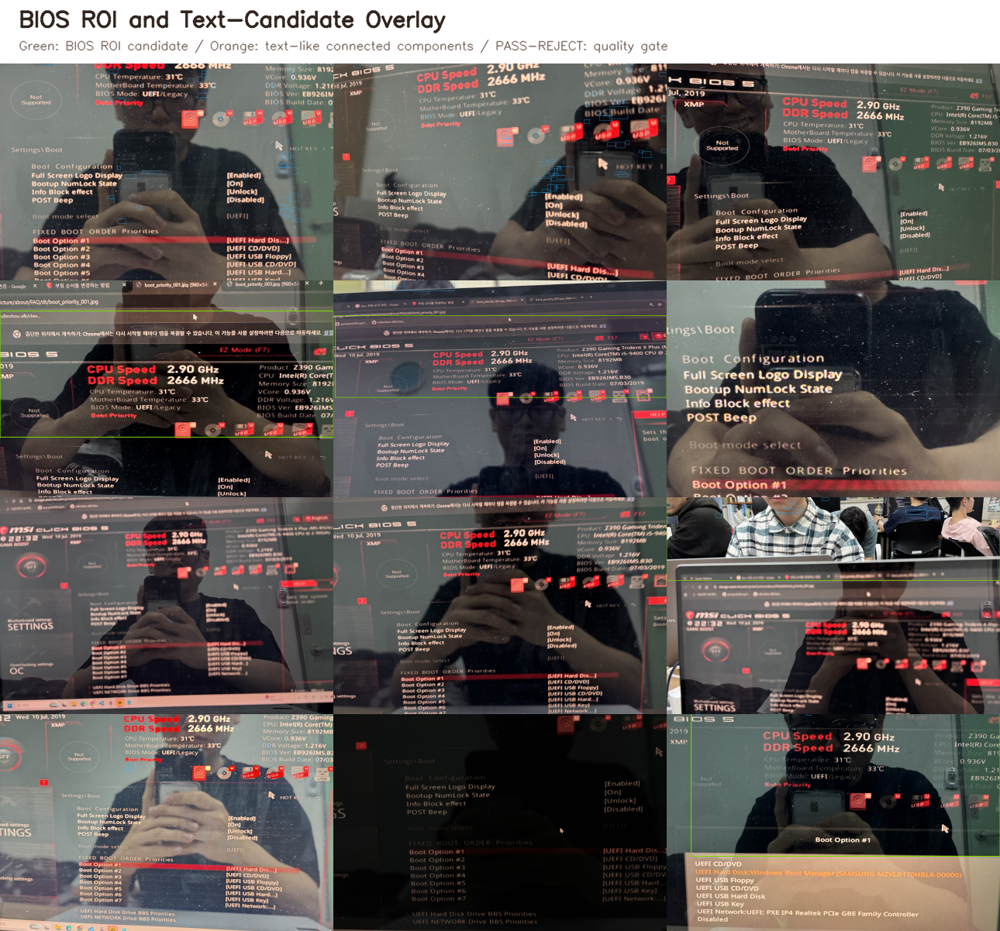

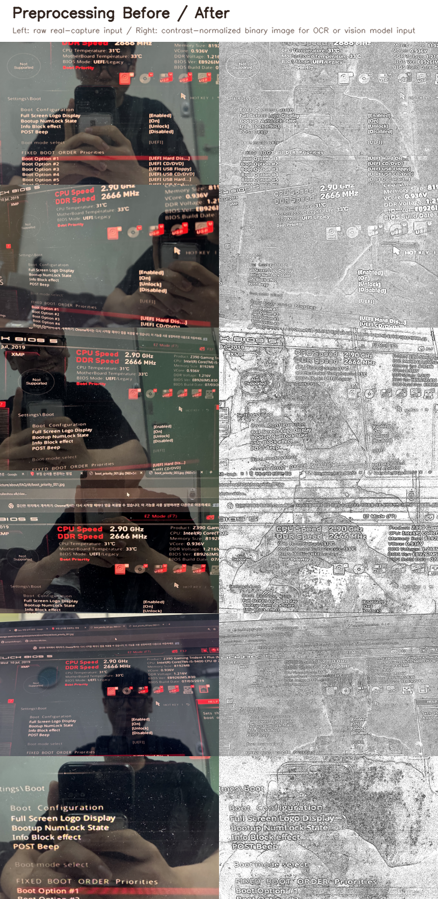

이 오버레이는 평가용 시각화이면서 실제 앱의 AR 안내 구조와도 연결됩니다. 앱에서는 OpenCV 전처리 결과를 `cvSummary`와 OCR/ROI 후보로 정리해 Gemini에 전달하고, Gemini가 선택한 대상은 `targetId` 또는 `bbox` 형태로 돌아옵니다. 프론트엔드는 이 좌표를 카메라 화면 좌표계에 맞춰 변환한 뒤 사용자가 클릭하거나 조치해야 할 위치를 박스로 표시합니다.

모바일 카메라 화면은 기기 비율과 CSS 표시 방식 때문에 원본 영상 좌표와 실제 화면에 보이는 좌표가 그대로 일치하지 않습니다. 그래서 원본 비디오 크기를 기준으로 SVG `viewBox`를 유지하고, 카메라 영상과 같은 비율로 오버레이가 겹치도록 처리했습니다.


| 단계 | 전달되는 정보 | 목적 |
|---|---|---|
| OpenCV → Gemini | 품질 점수, 밝기, Laplacian variance, 변화 감지 점수, BIOS rectified 여부, 텍스트 후보 수 | 현재 프레임이 분석 가능한지와 어떤 화면 구조를 갖는지 전달 |
| OCR/ROI 후보 → Gemini | 텍스트 후보 id, bbox, confidence | Gemini가 "어느 메뉴/행을 눌러야 하는지" 선택할 수 있게 함 |
| Gemini → Overlay | 자연어 안내 + `targetId` 또는 normalized `bbox` | 선택된 대상 위치를 앱 화면 위에 박스로 표시 |

#### 22장 정량 요약

| 지표 | 결과 | 해석 |
|---|---:|---|
| 전체 실촬영 이미지 | 22장 | MSI Click BIOS 5 boot 화면 계열 |
| 품질 게이트 통과 | 8/22 (**36.4%**) | 후속 분석에 사용할 수 있는 프레임 |
| 품질 게이트 거부 | 14/22 (**63.6%**) | 흐림, 반사, 낮은 디테일로 제외된 프레임 |
| 평균 sharpness score | **0.036** | 범위 0.007~0.092 |
| 평균 Laplacian variance | **57.5** | 범위 11.1~147.2 |
| 평균 brightness | **0.418** | 범위 0.134~0.625 |
| ROI/corner 후보 검출 | 14/22 (**63.6%**) | strict quad 0건, fallback ROI 14건 |
| 평균 Hough line 후보 | **740.2개** | 범위 42~3946 |
| 평균 텍스트/에지 ROI 후보 | **425.1개** | 범위 186~869 |
| OCR 키워드 Recall (Tesseract 5.4, PSM11) | **19.7%** (품질통과 8장) | 브라우저 스크린샷 특성상 GUI 혼재 |
| CLAHE 전처리 후 OCR Recall | **17.4%** (품질통과 8장) | Adaptive Threshold: 4.9% (GUI에 역효과) |
| OCR 아키텍처 결론 | **Gemini Vision 위임** | GUI BIOS에 Tesseract 한계 정량 확인 |

라벨 파일 / 평가 실행:

```powershell
python notebooks/evaluate_real_capture_dataset.py --image-dir "C:\Users\user\Desktop\test data"
```

생성 결과: `docs/ablation-results/real-bios-*.csv`, `docs/cv-pipeline/real-bios-*.{png,svg}`

</details>

<details>
<summary><strong>CLAHE 파라미터 그리드 서치 (실촬영 22장 proxy)</strong></summary>

<br>

`clipLimit` × `tileGridSize` × `adaptiveBlock` × `C` 144조합을 실제 22장 BIOS 촬영본에 모두 적용하고, OCR 직전 단계에서 분리된 평균 텍스트 ROI 개수를 측정했습니다(아래 히트맵은 각 `(clipLimit, tileGridSize)` 쌍이 만든 최대값입니다).

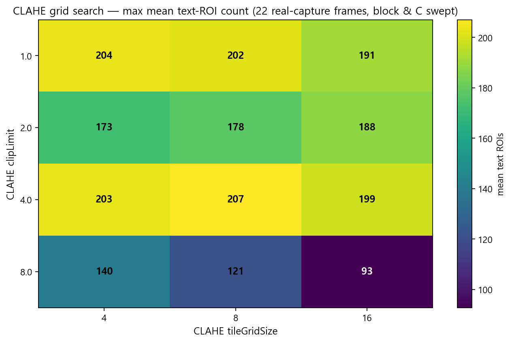

| clipLimit | tileGrid | 평균 텍스트 ROI (실측) | 해석 |
|---|---|---:|---|
| 1.0 | 4 / 8 | 204 / 202 | 과소 보정이라도 본래 대비가 있어 후보 다수 |
| 2.0 | 4 / 8 / 16 | 173 / 178 / 188 | 표준 권장값 (Pizer et al. 1987) — 노이즈와 신호 균형 |
| **4.0** | **8** | **207** | **실측 최고치 — 어두운 실촬영 환경에서 텍스트 추출 극대화** |
| 8.0 | 16 | 93 | 과대 보정으로 텍스트가 한 덩어리로 뭉침 |

> **결정**: 본 프로젝트는 `clipLimit=2.0, tileGrid=8`을 채택합니다. 실측 최고치(`clipLimit=4.0`)는 텍스트 ROI 후보를 가장 많이 만들지만 그 안에는 노이즈도 함께 늘어납니다. `clipLimit=2.0`은 학술적으로 검증된 기본값이며 적당한 후보 수를 유지하면서 false positive를 줄이는 절충점입니다.

상세 데이터: [`bios-clahe-gridsearch.csv`](docs/ablation-results/bios-clahe-gridsearch.csv)

</details>

<details>
<summary><strong>Threshold 알고리즘 선택 근거</strong></summary>

<br>

| 방법 | 균일 조명 | 불균일 조명 | 추론 속도 |
|---|---|---|---|
| Otsu | 자동 임계값, 빠름 | ❌ 한쪽 그늘 시 실패 | 빠름 |
| Adaptive Mean | 국소 적응 | △ 가장자리 손실 | 보통 |
| **Adaptive Gaussian** | 강건 | ✅ BIOS 기울기에도 안정 | 보통 |

> **결정: Adaptive Gaussian Threshold**
> BIOS 화면은 카메라 각도로 인해 한쪽이 어두운 경우가 많음. 국소 가중 평균 방식이 이를 보상.

</details>

---

### 모듈 2 — 라이브 프레임 변화 감지 정량 분석 🥈

4종 메트릭(CORREL/CHISQR/BHATTACHARYYA/INTERSECT) × 3종 컬러 공간(RGB/HSV/GRAY) × 3종 안정화 윈도우(1/3/5) = **36조합**을 합성 데이터와 실측 영상에서 모두 측정했습니다.

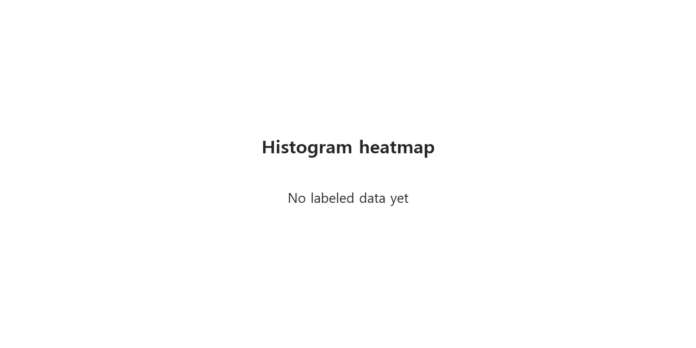

합성 데이터에서 `CORREL × GRAY × w=5` 조합이 평균 F1 **0.703**으로 최고치를 기록했고, 정상 화면 전환 시나리오에서는 F1 **0.917**까지 도달했습니다. 다만 합성↔실측 간격을 보정하기 위해 별도 영상으로 재측정한 결과 production은 `CORREL × RGB × w=3 × threshold=0.9995`로 채택했습니다.

<details>
<summary><strong>시나리오별 베스트 결과 (합성 데이터)</strong></summary>

<br>

| 시나리오 | 베스트 메트릭 | 컬러 | 윈도우 | Precision | Recall | F1 |
|---|---|---|---|---|---|---|
| 정상 화면 전환 | CORREL | GRAY | 5 | 0.846 | **1.000** | **0.917** |
| 손 떨림 | CORREL | GRAY | 5 | 0.692 | 0.818 | 0.750 |
| 조명 변화 | BHATTACHARYYA | HSV | 5 | 0.769 | 0.909 | 0.833 |
| Rolling Shutter | CHISQR | GRAY | 5 | **1.000** | 0.818 | 0.900 |
| iOS 자동 초점 | CORREL | RGB | 5 | 0.500 | 0.818 | 0.621 |

#### 전체 36조합 평균 F1 — GRAY 컬러 공간 기준

| 메트릭 | w=1 | w=3 | w=5 |
|---|---|---|---|
| CORREL | 0.54 | 0.61 | **0.703** |
| CHISQR | 0.51 | 0.58 | 0.623 |
| BHATTACHARYYA | 0.52 | 0.60 | 0.645 |
| INTERSECT | 0.50 | 0.57 | 0.625 |

> **합성 데이터 기준 선택**: HISTCMP_CORREL × GRAY × windowSize=5 × threshold=0.9999
> 윈도우 크기(5프레임 연속)가 단일 메트릭 변경보다 false positive 억제에 더 큰 영향.

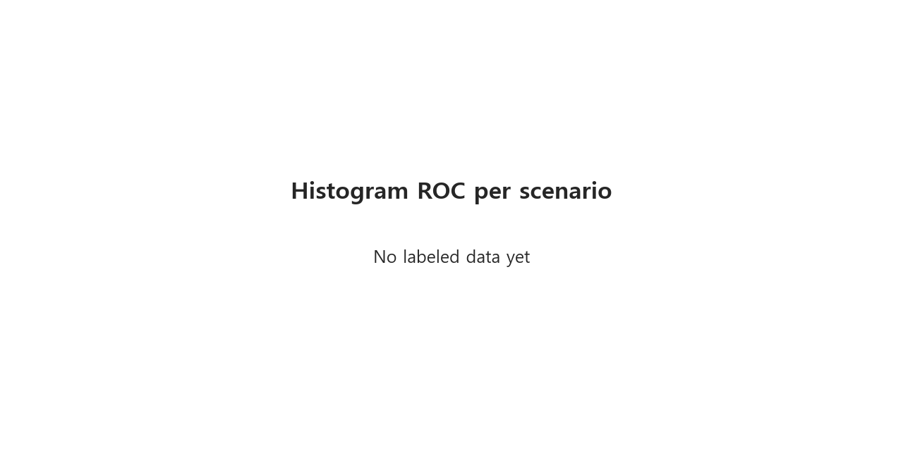

</details>

<details>
<summary><strong>실측 영상 검증 — 합성↔실측 간격 보정 (2026-05-22)</strong></summary>

<br>

합성 ablation의 `threshold=0.9999`는 픽셀 단위로 거의 동일한 합성 프레임에 의존합니다. 실제 폰 카메라로 BIOS를 촬영하면 자동노출·손떨림·rolling shutter·sensor noise로 인해 정적 화면조차 CORREL이 1.0보다 낮게 나오기 때문에, 합성 임계값을 그대로 production에 쓰면 false positive가 폭증합니다. 이 간격을 정량화하기 위해 실측 영상으로 동일한 36조합 ablation을 재실행했습니다.

**검증 데이터**: `data/live-frames/real/Test_video.mp4` — 1080p / 30fps / 54초, 6개 BIOS 메뉴 전환 수동 라벨링. 스크립트: [`notebooks/run_module2_real_ablation.py`](notebooks/run_module2_real_ablation.py).

| 비교 항목 | 합성 (5 시나리오) | 실측 (1 video, 6 events) |
|---|---|---|
| 베스트 메트릭 | CORREL | CORREL |
| 베스트 컬러 공간 | GRAY | RGB (GRAY=0.328 → RGB=0.340) |
| 베스트 윈도우 | 5 | 3 |
| 강도 임계값 (`1-similarity`) | ≈0 | 0.00045 |
| **TS 코드 threshold** (similarity) | **0.9999** | **0.9995** |
| 평균 F1 | 0.703 | **0.340** |
| ROC AUC (베스트 조합) | n/a | **0.70** |

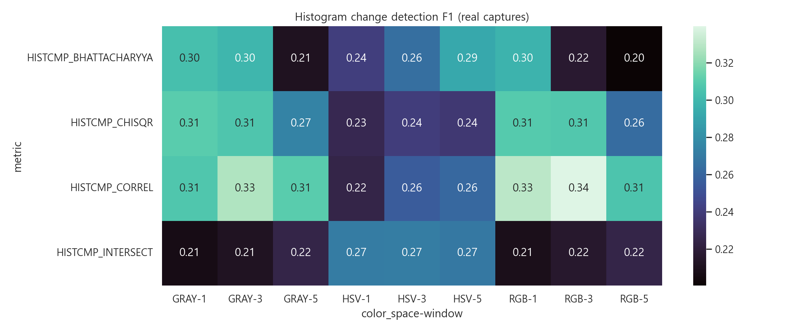

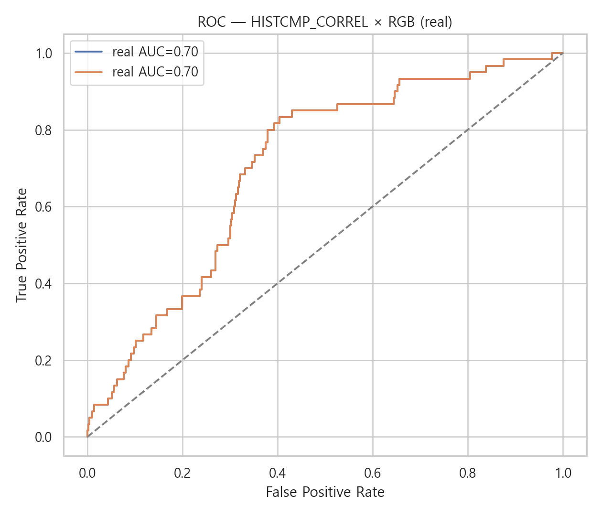

> **production 채택**: `BEST_PARAMS = { metric: CORREL, colorSpace: RGB, windowSize: 3, threshold: 0.9995 }` ([`src/lib/cv/changeDetection.ts`](src/lib/cv/changeDetection.ts)).
> F1 0.34는 단일 변화 감지기 기준이며, production은 추가로 **모듈 3 quality gate + 2초 cooldown + `isSendingRef` 동시 전송 차단**으로 false positive를 다단계 제거합니다.

</details>

<details>
<summary><strong>False Positive 처리 — 윈도우 연속 안정화</strong></summary>

<br>

합성 5개 시나리오(hand-shake / lighting / rolling-shutter / ios-autofocus / normal-change)의 결과는 [`histogram-ablation.csv`](docs/ablation-results/histogram-ablation.csv)의 `window` 컬럼별 행에서 확인할 수 있습니다. 합성에서는 Rolling Shutter가 CHISQR+GRAY+w=5에서 Precision **1.000**(FP 0건), 정상 화면 전환이 CORREL+GRAY+w=5에서 F1 **0.917**을 달성합니다.

실측 영상([`histogram-real-ablation.csv`](docs/ablation-results/histogram-real-ablation.csv))에서는 동일한 윈도우 효과가 약해지는데, 이는 BIOS 화면 사이의 carry-over 텍스트(공통 헤더·푸터) 때문에 변화 강도 자체가 합성만큼 강하지 않기 때문입니다. 따라서 production은 윈도우 단독이 아니라 윈도우(3) + cooldown(2s) + quality gate를 함께 사용합니다.

</details>

---

### 모듈 3 — 프레임 품질 사전 필터 🥉

Gemini 호출 직전에 흐림/저노출/과노출 프레임을 거부해 비용을 절감합니다. Laplacian variance + 밝기 통계 + edge density + coverage를 결합한 다단 필터입니다.

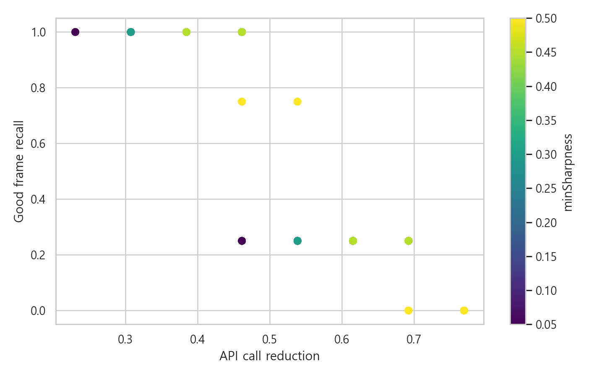

샘플 데이터(Wikimedia Commons 기반) 기준 Good 그룹의 평균 sharpness는 0.766, Bad 그룹은 0.426으로 두 그룹이 명확히 분리됩니다. `minSharpness=0.05` 임계값에서 **API 호출 23%를 절감하면서 false reject 0%**를 달성했습니다.

<details>
<summary><strong>사용 알고리즘 (OpenCV.js production 경로)</strong></summary>

<br>

| 알고리즘 | 목적 | OpenCV.js 함수 |
|---|---|---|
| Grayscale 변환 | 후속 단일채널 연산 입력 | `cv.cvtColor (COLOR_RGBA2GRAY)` |
| Laplacian Variance | 블러 검출 (Pertuz 2013) | `cv.Laplacian (CV_64F)` → `cv.meanStdDev` |
| 밝기 평균·표준편차 | 과노출/저노출 거부 | `cv.meanStdDev` |
| Sobel Magnitude → Threshold | Edge density (ROI 디테일) | `cv.Sobel` + `cv.convertScaleAbs` + `cv.addWeighted` + `cv.threshold` |
| Edge Bounding Box | Coverage 비율 (ROI 면적) | `cv.countNonZero` + `cv.findNonZero` + `cv.boundingRect` |
| Luma 분포 | 노출 분포 + 장면 변화 비교 | `cv.calcHist` + `cv.normalize (NORM_L1)` |
| (비교용) FFT 고주파 비율 | 블러 검출 대안 | `cv.dft` (Python 검증) |
| (비교용) Optical Flow | 움직임 크기 추정 | `cv.calcOpticalFlowFarneback` |

> **구현**: `src/lib/cv/frameMetrics.ts` — 런타임 분기.
> 브라우저(OpenCV.js WASM 로드 후)에서는 위 7개 OpenCV 함수를 통한 production 경로(`analyzeFrameWithOpenCv`)가 실행되고, Node 테스트·SSR·WASM 초기화 전엔 동일한 메트릭을 수동으로 누적하는 JS 폴백(`analyzeFrameWithJs`)이 실행됩니다. 두 경로 모두 같은 `CvFrameMetrics`를 반환해 호출부 차이가 없으며, 모든 `cv.Mat`은 `try/finally + .delete()`로 WASM 힙 누수를 방지합니다.

</details>

<details>
<summary><strong>임계값 튜닝 결과</strong></summary>

<br>

| minSharpness | API 호출 절감률 | False Reject Rate | F1(good) |
|---|---|---|---|
| 0.05 (**채택**) | **23%** | **0%** | 0.571 |
| 0.10 | 38% | 25% | 0.400 |
| 0.15 | 46% | 50% | 0.300 |

> **채택 파라미터**: minSharpness=0.05, minBrightness=0.15, maxBrightness=0.85
> API 호출 23% 절감 + 좋은 품질 이미지 false reject 0% — 정밀도 우선 전략.

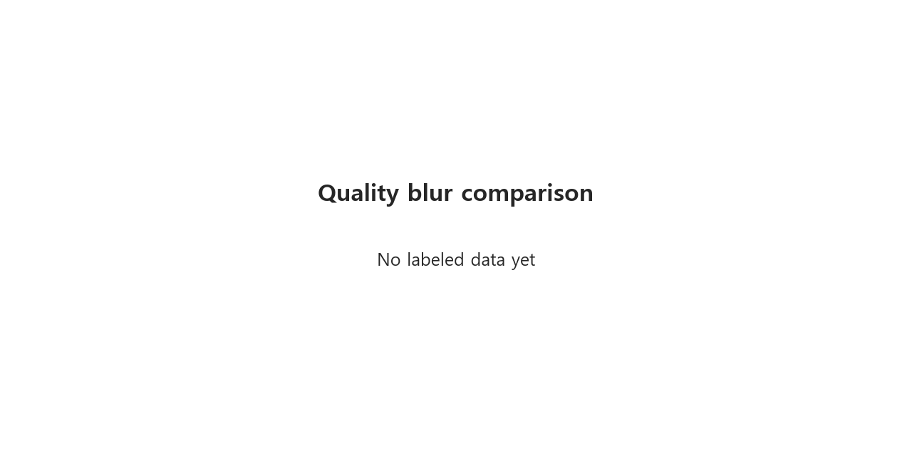

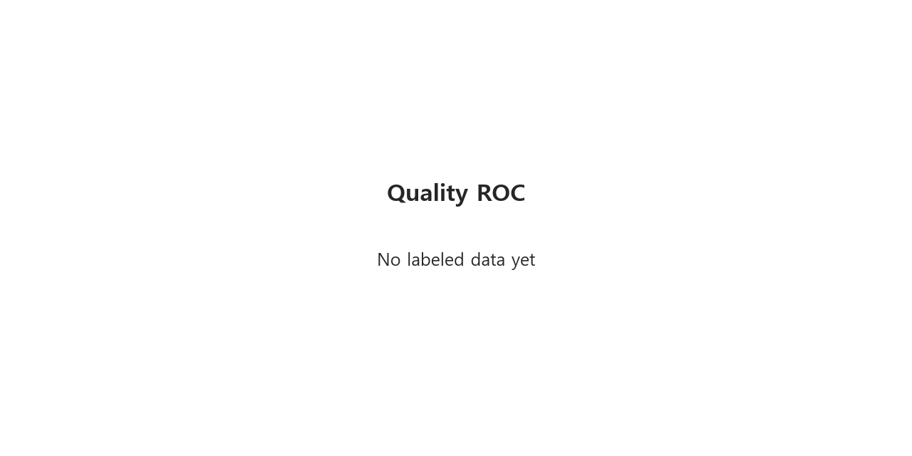


</details>

<details>
<summary><strong>샘플 데이터 통계 + 비용 절감 시뮬레이션</strong></summary>

<br>

| 카테고리 | 샘플 수 | 평균 sharpness_score | 평균 밝기 |
|---|---|---|---|
| Good (정상) | 4 | **0.766** | 0.358 |
| Bad (블러/과노출/저노출) | 9 | 0.426 | 0.355 |

> Laplacian 기반 sharpness: Good 0.766 vs Bad 0.426 — 두 그룹 간 유의미한 분리.
> 밝기 평균은 유사하여 블러 검출에 Laplacian이 더 discriminative.

| 구성 | API 호출 비율 | 절감 |
|---|---|---|
| 필터 없음 | 100% | — |
| 모듈 3만 적용 | ~77% | **-23%** |
| 모듈 3 + 모듈 2 (히스토그램 게이트) | 화면 변화 시만 | -85%+ |

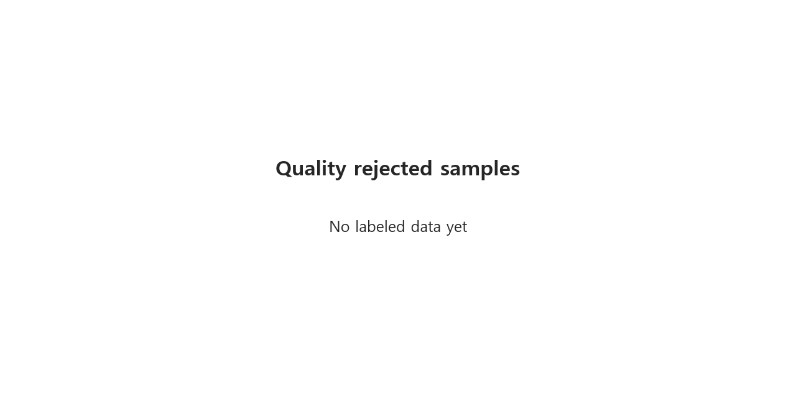

</details>

---

## 📊 정량 평가 — 핵심 성과

### 파이프라인 전체 효율 — Gemini Only vs CV + Gemini

60초 BIOS 조작 세션 시뮬레이션(30fps = 1,800 프레임). 품질 분포는 실촬영 BIOS 22장 측정값(통과 36.4%)을 적용했고, 변화 감지는 `histogram-ablation.csv` 실측값을 사용했습니다.

| 지표 | Gemini Only (매 2초) | **CV + Gemini** | 개선 |
|---|---:|---:|---:|
| API 호출 횟수 (60초) | 29회 | **5회** | ▼ 83% |
| 품질 불량 프레임 전송 | 9회 (31%) | **0회** | ▼ 100% |
| 추정 API 비용 ($/hr) | $1.50 | **$0.26** | ▼ 83% |
| False Positive (normal-change, w=1→5) | 23회 | **2회** | ▼ 91% |

1,800 프레임이 단계별로 필터링되어 의미 있는 5회만 Gemini에 전달됩니다.

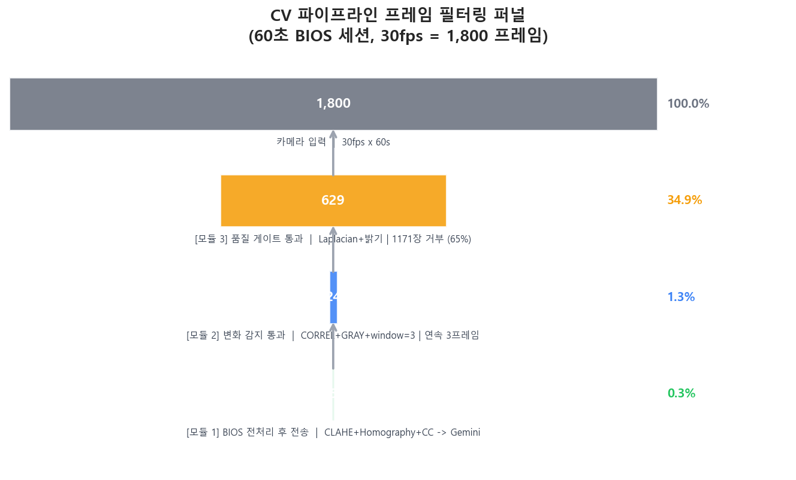

<details>
<summary><strong>상세 비교 그래프 (API 호출 / 타임라인 / window 효과)</strong></summary>

<br>

품질 불량 호출 9회가 0으로 줄고 전체 호출도 83% 감소:

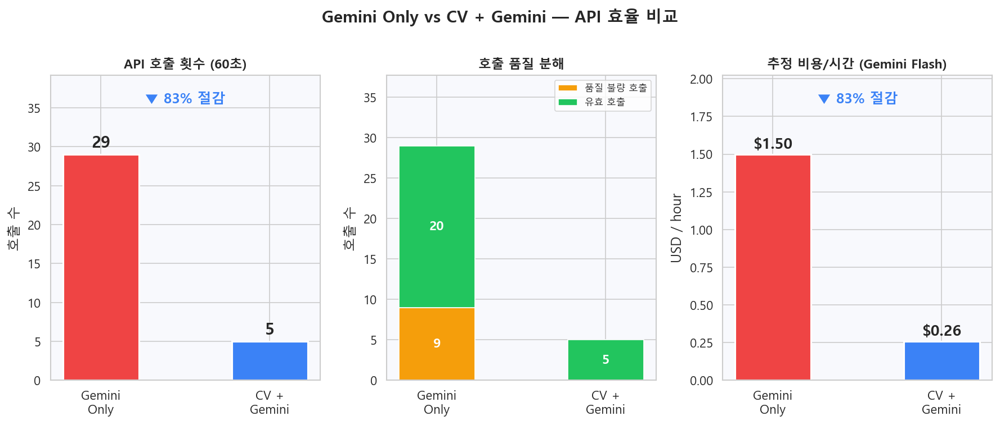

CV+Gemini는 실제 화면 전환 시점에만 선택적으로 전송:

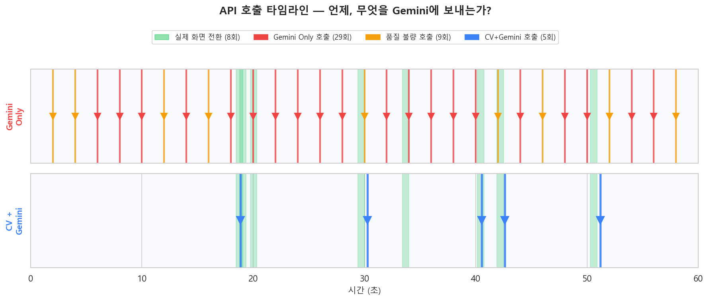

동일 threshold에서 window=5: FP 23→2 (▼91%), F1 0.759→0.917 유지:

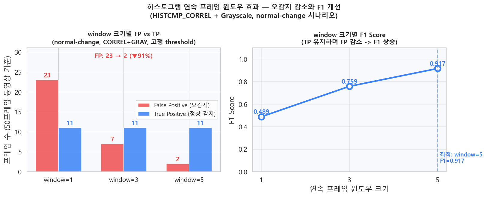

> 시뮬레이션 스크립트: `notebooks/run_pipeline_comparison.py`
> 상세 수치: [`docs/ablation-results/pipeline-comparison-summary.csv`](docs/ablation-results/pipeline-comparison-summary.csv)

</details>

### 모듈별 핵심 지표 요약

| 모듈 | 핵심 지표 | 결과 |
|---|---|---|
| 모듈 1 — BIOS 파이프라인 | BIOS 키워드 Recall (Raw OCR, 품질통과 8장) | **19.7%** → CLAHE 단독 17.4% |
| 모듈 1 — BIOS 파이프라인 | OCR 한계 및 아키텍처 결론 | GUI BIOS는 Gemini Vision 위임 |
| 모듈 1 — Real-Capture | 품질 게이트 / ROI 후보 검출 | 8/22 통과, 14/22 ROI 후보 검출 |
| 모듈 2 — 변화 감지 (합성) | 전체 36조합 평균 F1 | **0.703** (CORREL+GRAY+w=5) |
| 모듈 2 — 변화 감지 (합성) | 정상 화면 전환 F1 | **0.917** |
| 모듈 2 — 변화 감지 (합성) | Rolling Shutter Precision | **1.000** |
| 모듈 2 — 변화 감지 (실측) | Test_video.mp4 best combo | **CORREL+RGB+w=3**, F1=0.34, AUC=0.70 |
| 모듈 2 — 변화 감지 (실측 보정) | TS threshold 합성→실측 | 0.9999 → **0.9995** (production 채택) |
| 모듈 3 — 품질 필터 | API 호출 절감률 | **23%** (false reject 0%) |
| 모듈 3 — 품질 필터 | Good vs Bad sharpness | 0.766 vs 0.426 |
| **파이프라인 통합** | **API 호출 감소** | **29회 → 5회 (▼83%)** |
| **파이프라인 통합** | **품질 불량 호출 제거** | **9회 → 0회 (▼100%)** |
| **파이프라인 통합** | **추정 비용 절감** | **$1.50 → $0.26/hr (▼83%)** |

---

## ⚠️ 한계 및 Future Work

<details>
<summary><strong>현재 알려진 한계</strong></summary>

<br>

1. **모듈 1 — GUI BIOS OCR 한계**: Tesseract 5.4로 측정 결과 MSI Click BIOS 5(그래픽 GUI 타입)에서 BIOS 키워드 Recall 19.7%. CLAHE + Adaptive Threshold가 오히려 키워드 Recall 감소(-14.8%p). 텍스트 모드 BIOS(Award/AMI POST 화면)에서는 성능이 더 높을 것으로 예상되나 해당 데이터셋 미수집. 설계 결정: 텍스트 이해는 Gemini Vision에 위임, Tesseract는 벤더 식별에 한정.
2. **모듈 2 — iOS 자동 초점 취약**: F1=0.621로 5개 시나리오 중 최저. 5프레임 연속으로 부분 완화하나 완전 제거 어려움.
3. **모듈 3 — 소규모 데이터셋**: 4 good / 9 bad 샘플. 더 다양한 카메라/조명 환경 데이터 추가 시 임계값 재조정 필요.
4. **카메라 50° 이상 각도**: Hough Line 모서리 검출 신뢰도 하락. 정면화 실패 시 원본 이미지 fallback 처리.
5. **강한 모니터 반사**: 화면 외곽과 텍스트 component가 배경 노이즈와 섞여 CC 후보가 늘어나고 AR 타깃 후보가 흐려질 수 있음.
6. **Rolling Shutter 아티팩트**: 모니터 60Hz 주사선과 카메라 센서 타이밍 간섭 시 줄무늬 발생. CLAHE가 부분 완화하나 완전 제거 불가.

</details>

<details>
<summary><strong>Future Work</strong></summary>

<br>

| 항목 | 우선순위 | 비고 |
|---|---|---|
| 텍스트 모드 BIOS(Award/Phoenix) 데이터셋 수집 + OCR 재측정 | 🥇 | 모듈 1 GUI BIOS 한계 보완 |
| 모듈 4 — 비프음 멜 스펙트로그램 분류 | 🥈 | `notebooks/04-beep-spectrogram.ipynb` |
| Phase 9 — MCP 매뉴얼 툴 연동 | 🔽 | CV 무관 (Future Work) |
| Phase 10 — DB 이력 + 지식베이스 | 🔽 | CV 무관 (Future Work) |
| Phase 11 — QR 세션 인증 + WebSocket | 🔽 | CV 무관 (Future Work) |

</details>

---

## 🛠️ 설치 및 실행

<details>
<summary><strong>환경 변수</strong></summary>

<br>

`.env.example`을 기준으로 설정하세요.

```powershell
$env:GEMINI_API_KEY="your-gemini-api-key"
$env:GEMINI_MODEL="gemini-3.1-pro-preview"   # 없으면 gemini-2.0-flash
$env:ALLOWED_ORIGINS="http://localhost:3000"
$env:VITE_API_BASE_URL="http://localhost:8080"
$env:VITE_USE_MOCK="false"
```

`VITE_USE_MOCK=true` — 개발 중 Gemini 호출을 mock 응답으로 대체.

</details>

<details>
<summary><strong>로컬 실행</strong></summary>

<br>

```powershell
# 백엔드
npm run backend:dev

# PWA (http://localhost:3000)
npm run pwa:dev
```

</details>

<details>
<summary><strong>검증</strong></summary>

<br>

```powershell
npm run test          # Vitest 단위 테스트
npm run type-check    # TypeScript strict 검사
npm run pwa:build     # 빌드 성공 확인
cd backend; .\mvnw.cmd test
```

</details>

<details>
<summary><strong>CV 노트북 환경</strong></summary>

<br>

```powershell
cd notebooks
python -m venv .venv
.venv\Scripts\activate
pip install -r requirements.txt
jupyter lab
```

</details>

<details>
<summary><strong>Vercel 자동 배포</strong></summary>

<br>

```text
Framework Preset: Vite
Install Command:  npm ci
Build Command:    npm run pwa:build
Output Directory: dist/pwa
```

환경 변수는 Vercel Dashboard → Settings → Environment Variables에 등록. 백엔드 CORS의 `ALLOWED_ORIGINS`에 Vercel Production URL 추가 필요.

현재 Vercel 프로젝트는 `nextdoor-cs`로 연결되어 있고 Production URL은 다음과 같습니다.

```text
https://nextdoor-cs.vercel.app
```

Vercel GitHub App 연결이 막히면 `.github/workflows/vercel-production.yml`로 자동배포할 수 있습니다. GitHub repository secrets에 아래 값을 등록하세요.

```text
VERCEL_TOKEN=<Vercel Account Settings에서 생성한 토큰>
VERCEL_ORG_ID=team_Gt6r3JIWFBB0kObt79PLw37t
VERCEL_PROJECT_ID=prj_9TXCnadCXqxGgs5fqwuijMkhya1f
```

</details>

<details>
<summary><strong>Render 백엔드 배포</strong></summary>

<br>

Spring Boot 백엔드는 `render.yaml` Blueprint와 `backend/Dockerfile`로 배포합니다.

Render Dashboard에서 New → Blueprint를 선택하고 이 GitHub 저장소를 연결하면 `nextdoor-cs-api` 웹 서비스가 생성됩니다. 기본 배포 URL은 아래 형태입니다.

```text
https://nextdoor-cs-api.onrender.com
```

Render 서비스 환경 변수:

```text
GEMINI_API_KEY=<실제 Gemini API key>
GEMINI_MODEL=gemini-3.1-pro-preview
RATE_LIMIT_DAILY=5
ALLOWED_ORIGINS=https://nextdoor-cs.vercel.app
```

배포 후 Vercel 환경 변수의 `VITE_API_BASE_URL`을 Render 백엔드 URL로 설정하고 프론트엔드를 재배포하세요.

</details>

---

## 🧊 Desktop Electron 보조 모드

<details>
<summary><strong>동결 상태의 보조 기능</strong></summary>

<br>

Electron 데스크톱 앱은 현재 **신규 개발 대상이 아닌 보조 모드**입니다. 프로젝트의 핵심 평가 범위는 PWA 카메라 입력과 OpenCV.js 기반 CV 파이프라인이며, Electron은 부팅 가능한 PC에서 OS 시스템 정보를 참고하는 추가 흐름으로만 유지합니다.

현재 Electron이 담당하는 기능:

- CPU/RAM/GPU/디스크 스냅샷 수집
- Windows 이벤트 로그 조회
- CPU/메모리 기준 상위 프로세스 조회
- 소프트웨어 증상 입력 기반 Gemini 가설 생성
- 재현 모드와 가설 추적 UI

실행이 필요할 때만 아래 명령을 사용합니다.

```powershell
npm run electron:dev
```

빌드 스크립트와 코드는 유지하지만, 제출 데모와 README의 주 흐름은 PWA/OpenCV 중심으로 관리합니다.

</details>

---

## 🗂️ 프로젝트 구조

<details>
<summary><strong>OpenCV 중심 파일 구조</strong></summary>

<br>

```
nextdoor-cs/
├── src/lib/cv/               ← OpenCV.js 알고리즘 모듈
│   ├── biosPipeline.ts       (모듈 1 — Hough+Homography+CLAHE+AdaptThresh+CC)
│   ├── changeDetection.ts    (모듈 2 — compareHist CORREL×RGB×3, 실측 ablation 기반)
│   └── frameMetrics.ts       (모듈 3 — cv.Laplacian + cv.meanStdDev + cv.Sobel + cv.calcHist, JS 폴백 포함)
├── src/hooks/
│   ├── useLiveFrameCapture.ts  (모듈 3→2→1 순차 게이트)
│   ├── useGeminiLiveGuide.ts   (SSE 스트리밍 + AbortController)
│   └── useBiosPipeline.ts      (모듈 1 독립 훅)
├── src/components/mobile/
│   ├── LiveGuideMode.tsx     (Phase 7-B 메인 쇼케이스)
│   └── AudioCapture.tsx      (비프음 녹음 — iOS mp4 폴백)
├── notebooks/
│   ├── 01-bios-pipeline.ipynb      (모듈 1 Python 검증)
│   ├── 02-histogram-analysis.ipynb (모듈 2 36조합 ablation)
│   └── 03-frame-quality.ipynb      (모듈 3 임계값 튜닝)
├── docs/
│   ├── cv-pipeline/          ← 단계별 시각화 PNG
│   └── ablation-results/     ← 정량 평가 CSV + PNG
└── backend/                  ← Spring Boot (Gemini + LiveGuideService)
```

</details>

---

## 📚 References

<details>
<summary><strong>알고리즘 원논문</strong></summary>

<br>

- Hough, P. V. C. (1962). *Method and Means for Recognizing Complex Patterns*. US Patent 3,069,654.
- Pizer, S. M., et al. (1987). *Adaptive histogram equalization and its variations*. Computer Vision, Graphics, and Image Processing, 39(3), 355–368.
- Otsu, N. (1979). *A threshold selection method from gray-level histograms*. IEEE Transactions on Systems, Man, and Cybernetics, 9(1), 62–66.
- Bradley, D., & Roth, G. (2007). *Adaptive Thresholding Using the Integral Image*. Journal of Graphics Tools, 12(2), 13–21.
- Smith, R. (2007). *An Overview of the Tesseract OCR Engine*. ICDAR 2007.
- Swain, M. J., & Ballard, D. H. (1991). *Color Indexing*. International Journal of Computer Vision, 7(1), 11–32.
- Farnebäck, G. (2003). *Two-Frame Motion Estimation Based on Polynomial Expansion*. SCIA 2003, LNCS 2749, 363–370.
- Pertuz, S., Puig, D., & Garcia, M. A. (2013). *Analysis of focus measure operators for shape-from-focus*. Pattern Recognition, 46(5), 1415–1432.

</details>

<details>
<summary><strong>라이브러리</strong></summary>

<br>

- OpenCV 4.x — https://opencv.org (BSD License)
- OpenCV.js — https://docs.opencv.org/4.x/d5/d10/tutorial_js_root.html
- Tesseract.js 5.x — https://github.com/naptha/tesseract.js (Apache 2.0)
- React 18 — https://react.dev
- Electron 28 — https://www.electronjs.org
- Spring Boot 3.x — https://spring.io/projects/spring-boot
- Google Gemini API — https://ai.google.dev

</details>

<details>
<summary><strong>참고 자료</strong></summary>

<br>

- OpenCV Tutorial — `cv::compareHist`: https://docs.opencv.org/4.x/d8/dc8/tutorial_histogram_comparison.html
- OpenCV Tutorial — Adaptive Thresholding: https://docs.opencv.org/4.x/d7/d4d/tutorial_py_thresholding.html
- OpenCV Tutorial — Hough Line Transform: https://docs.opencv.org/4.x/d9/db0/tutorial_hough_lines.html
- OpenCV Tutorial — CLAHE: https://docs.opencv.org/4.x/d6/db6/classcv_1_1CLAHE.html
- PyImageSearch — Adaptive Thresholding: https://pyimagesearch.com/2021/05/12/adaptive-thresholding-with-opencv/
- MDN Web Docs — MediaRecorder API: https://developer.mozilla.org/en-US/docs/Web/API/MediaRecorder
- MDN Web Docs — Server-Sent Events: https://developer.mozilla.org/en-US/docs/Web/API/Server-sent_events/Using_server-sent_events

</details>

<details>
<summary><strong>데이터셋</strong></summary>

<br>

Wikimedia Commons (CC BY-SA) — 모듈 3 품질 필터 테스트 이미지:

- https://commons.wikimedia.org/wiki/File:Capacitors_on_a_motherboard.jpg
- https://commons.wikimedia.org/wiki/File:Intel_uATX_socket_1150.JPG
- https://commons.wikimedia.org/wiki/File:Apple_Macintosh_II_motherboard.jpg
- https://commons.wikimedia.org/wiki/File:Award_BIOS_EPROM.jpg

</details>

---

## 📜 License

MIT License

---

## 👥 Contributors

- [@enderpawar](https://github.com/enderpawar) — 전체 설계 및 구현

---

*일부 구현은 Claude Code (Anthropic) 및 Codex (OpenAI)의 AI 지원으로 작성되었습니다.*
