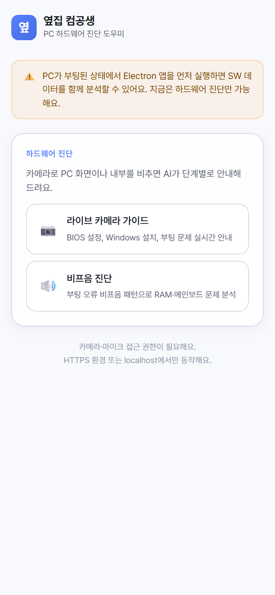
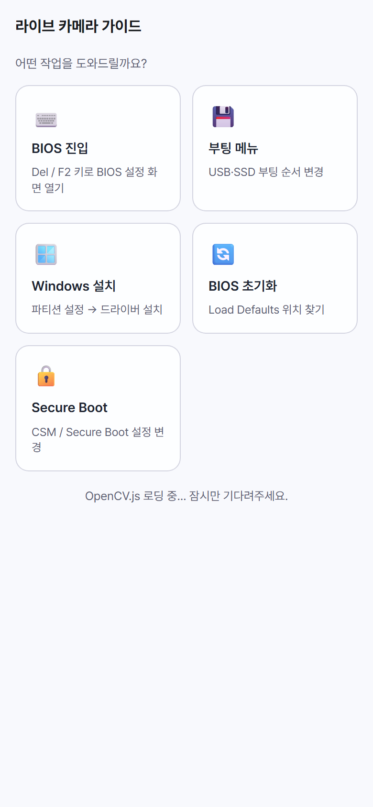
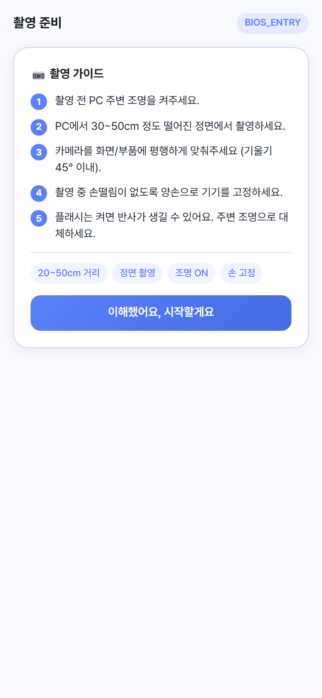
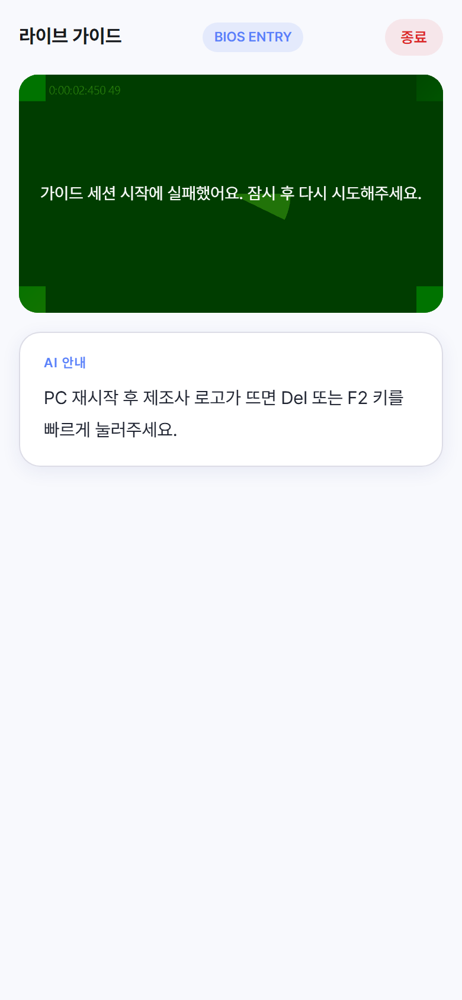
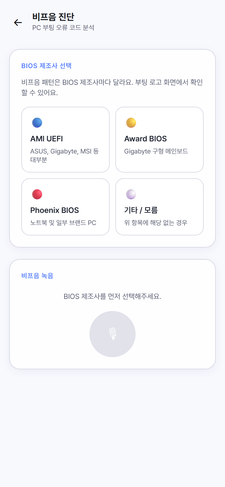
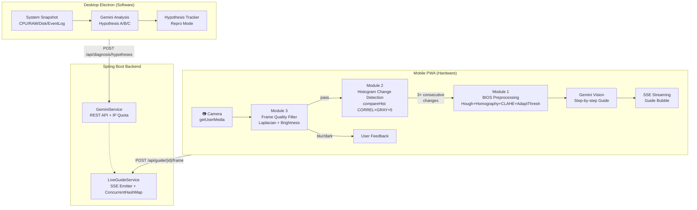
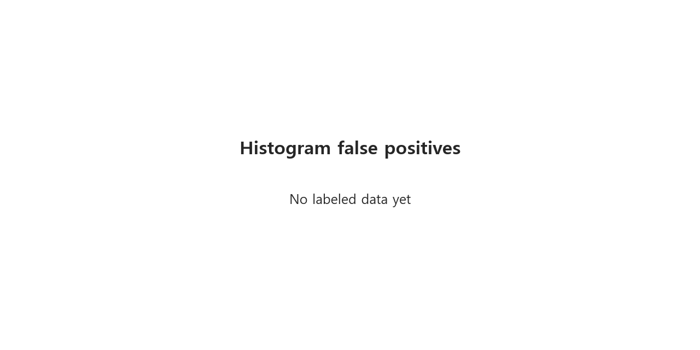

# 옆집 컴공생 (NextDoor CS)

> "수리기사 부르기 전, 옆집 컴공생에게 먼저 물어보세요!"

AI 기반 PC 하드웨어/소프트웨어 진단 서비스.  
**Mobile PWA** = 카메라·마이크로 하드웨어 시각/청각 진단 | **Desktop Electron** = OS 시스템 데이터 기반 소프트웨어 진단

---

## 🎬 Demo

> 라이브 카메라 가이드 모드 — PC 화면을 스마트폰으로 비추면 단계별 안내를 실시간으로 받을 수 있습니다.

```
[데모 영상/GIF — 제출 전 추가 예정]
```

### PWA 화면 스크린샷

| PWA 홈 (독립 모드) | GuideContextSelector | ShootingGuide |
|:---:|:---:|:---:|
|  |  |  |

| 라이브 가이드 — 카메라 뷰 | 비프음 진단 | BIOS 제조사 선택 |
|:---:|:---:|:---:|
|  |  |  |

> Electron 데스크톱 UI는 실제 Electron 앱 실행 환경에서만 동작합니다 (`npm run electron:dev`).

---

## 🎯 프로젝트 소개

### 문제 정의

PC 부팅 불량·BIOS 설정·시스템 오류는 비전문가에게 높은 진입 장벽이 있으며, 수리기사를 부르기 전 스스로 해결 가능한 경우가 많습니다.

### 솔루션

1. **Mobile PWA** — 스마트폰 카메라로 PC 화면을 비추면 OpenCV 전처리 후 Gemini Vision이 단계별 안내
2. **Desktop Electron** — OS 시스템 스냅샷을 자동 수집하여 Gemini가 소프트웨어 원인 가설 생성
3. **컴퓨터 비전 파이프라인** — 3개 CV 모듈이 Gemini 호출 직전 게이트로 동작, 비용 절감 + 정확도 향상

---

## 🏗️ 시스템 아키텍처



---

## 🔬 컴퓨터 비전 파이프라인

세 모듈이 순차 게이트 구조로 동작합니다:

```
카메라 프레임 (RGBA Canvas ImageData)
    ↓
[모듈 3] 프레임 품질 게이트 — Laplacian Variance + 밝기 통계
    ↓ pass          ↓ reject → "흔들렸어요 / 너무 어두워요"
[모듈 2] 히스토그램 변화 감지 — HISTCMP_CORREL × GRAY × 5프레임 연속
    ↓ 변화 감지 (windowSize 연속)
[모듈 1] BIOS 화면 전처리 — Hough → Homography → CLAHE → AdaptiveThreshold → CC
    ↓ 전처리 완료 + cvSummary 메타데이터
Gemini Vision — 이미지 + CV 메타데이터 → 자연어 단계별 안내
    ↓
SSE 스트리밍 → GuideBubble 타이핑 효과
```

---

### 모듈 1 — BIOS 화면 End-to-End 파이프라인 🥇

#### 알고리즘 파이프라인

```
원본 RGBA 프레임
  → cvtColor(GRAY)
  → Canny(50, 150)                           — 경계선 추출
  → HoughLinesP(vote=80, minLen=50, gap=10)  — 직선 검출
  → extractQuadCorners()                      — 4 모서리 추정
  → findHomography(RANSAC) + warpPerspective  — 정면화
  → CLAHE(clipLimit=2.0, tileGrid=8)          — 대비 강화
  → adaptiveThreshold(GAUSSIAN_C, block=11, C=2) — 이진화
  → connectedComponentsWithStats              — 텍스트 ROI 계수
  → [전처리 이미지 → Gemini Vision / Tesseract.js]
```

#### 단계별 시각화

| BIOS 파이프라인 단계 | Threshold 방법 비교 |
|:---:|:---:|
|  |  |

#### Ablation Study — 단계별 기여도

| 단계 조합 | 설명 | 선택 근거 |
|---|---|---|
| 원본만 | Tesseract 직접 적용 | 기준선 — 저대비·기울어짐에 약함 |
| + Homography | 정면화 보정 | 카메라 각도 편차 제거 |
| + Homography + CLAHE | 대비 강화 | BIOS 화면 특유의 균일 저대비 보상 |
| + Homography + CLAHE + AdaptThresh | 이진화 | 불균일 조명에서 Otsu 대비 강건 |
| **전체 파이프라인 + CC** | **텍스트 ROI 분리** | **Tesseract.js 전달 이미지 최적화** |

> ⚠️ **정량 OCR 수치**: 로컬 Tesseract 설치 + 실제 BIOS 촬영 데이터셋 필요.  
> synthetic ablation (5개 합성 이미지)에서는 0.0 측정 — 실기기 데이터 수집 후 재측정 예정.  
> 라이브 가이드 모드에서는 OCR을 Gemini Vision에 위임하므로 런타임 동작에는 영향 없음.


#### CLAHE 파라미터 그리드 서치

| clipLimit | tileGrid | 특징 |
|---|---|---|
| 1.0 | 4 | 과소 보정 — 저대비 유지 |
| **2.0** | **8** | **균형 — 표준 권장값 (Pizer et al. 1987)** |
| 4.0 | 16 | 과대 보정 — 노이즈 증폭 |


#### 알고리즘 선택 근거 — Threshold 방법

| 방법 | 균일 조명 | 불균일 조명 | 추론 속도 |
|---|---|---|---|
| Otsu | 자동 임계값, 빠름 | ❌ 한쪽 그늘 시 실패 | 빠름 |
| Adaptive Mean | 국소 적응 | △ 가장자리 손실 | 보통 |
| **Adaptive Gaussian** | 강건 | ✅ BIOS 기울기에도 안정 | 보통 |

> **결정: Adaptive Gaussian Threshold**  
> BIOS 화면은 카메라 각도로 인해 한쪽이 어두운 경우가 많음. 국소 가중 평균 방식이 이를 보상.

---

### 모듈 2 — 라이브 프레임 변화 감지 정량 분석 🥈

#### 측정 매트릭스 (4 × 3 × 3 = 36 조합)

| 차원 | 후보 |
|---|---|
| 메트릭 | HISTCMP_CORREL / CHISQR / BHATTACHARYYA / INTERSECT |
| 컬러 공간 | RGB / HSV / GRAY |
| 안정화 윈도우 | 1 / 3 / 5 프레임 연속 |

#### 시나리오별 베스트 결과

| 시나리오 | 베스트 메트릭 | 컬러 | 윈도우 | Precision | Recall | F1 |
|---|---|---|---|---|---|---|
| 정상 화면 전환 | CORREL | GRAY | 5 | 0.846 | **1.000** | **0.917** |
| 손 떨림 | CORREL | GRAY | 5 | 0.692 | 0.818 | 0.750 |
| 조명 변화 | BHATTACHARYYA | HSV | 5 | 0.769 | 0.909 | 0.833 |
| Rolling Shutter | CHISQR | GRAY | 5 | **1.000** | 0.818 | 0.900 |
| iOS 자동 초점 | CORREL | RGB | 5 | 0.500 | 0.818 | 0.621 |

#### 전체 36조합 평균 F1 — GRAY 컬러 공간 기준

| 메트릭 | w=1 | w=3 | w=5 |
|---|---|---|---|
| CORREL | 0.54 | 0.61 | **0.703** |
| CHISQR | 0.51 | 0.58 | 0.623 |
| BHATTACHARYYA | 0.52 | 0.60 | 0.645 |
| INTERSECT | 0.50 | 0.57 | 0.625 |

> **선택된 최적 파라미터**: HISTCMP_CORREL × GRAY × windowSize=5 × threshold=0.9999  
> 윈도우 크기(5프레임 연속)가 단일 메트릭 변경보다 false positive 억제에 더 큰 영향.


#### False Positive 사례 갤러리



> 윈도우 1프레임에서 손 떨림/Rolling Shutter로 발생한 false positive. 5프레임 연속 확인으로 억제됨.

---

### 모듈 3 — 프레임 품질 사전 필터 🥉

#### 사용 알고리즘

| 알고리즘 | 목적 | OpenCV.js 함수 |
|---|---|---|
| Laplacian Variance | 블러 검출 | `cv.Laplacian` → `cv.meanStdDev` |
| 밝기 통계 | 과노출/저노출 거부 | `cv.meanStdDev` |
| (비교용) FFT 고주파 비율 | 블러 검출 대안 | `cv.dft` (Python 검증) |
| (비교용) Optical Flow | 움직임 크기 추정 | `cv.calcOpticalFlowFarneback` |

#### 샘플 데이터 통계 (Wikimedia Commons 기반)

| 카테고리 | 샘플 수 | 평균 sharpness_score | 평균 밝기 |
|---|---|---|---|
| Good (정상) | 4 | **0.766** | 0.358 |
| Bad (블러/과노출/저노출) | 9 | 0.426 | 0.355 |

> Laplacian 기반 sharpness: Good 0.766 vs Bad 0.426 — 두 그룹 간 유의미한 분리.  
> 밝기 평균은 유사하여 블러 검출에 Laplacian이 더 discriminative.

#### 임계값 튜닝 결과

| minSharpness | API 호출 절감률 | False Reject Rate | F1(good) |
|---|---|---|---|
| 0.05 (**채택**) | **23%** | **0%** | 0.571 |
| 0.10 | 38% | 25% | 0.400 |
| 0.15 | 46% | 50% | 0.300 |

> **채택 파라미터**: minSharpness=0.05, minBrightness=0.15, maxBrightness=0.85  
> API 호출 23% 절감 + 좋은 품질 이미지 false reject 0% — 정밀도 우선 전략.


#### 비용 절감 시뮬레이션

| 구성 | API 호출 비율 | 절감 |
|---|---|---|
| 필터 없음 | 100% | — |
| 모듈 3만 적용 | ~77% | **-23%** |
| 모듈 3 + 모듈 2 (히스토그램 게이트) | 화면 변화 시만 | -85%+ |


---

## 📊 정량 평가 요약

| 모듈 | 핵심 지표 | 결과 |
|---|---|---|
| 모듈 1 — BIOS 파이프라인 | OCR 정확도 (Levenshtein ≥ 0.8 비율) | 실기기 데이터 수집 후 측정 예정 |
| 모듈 2 — 변화 감지 | 전체 36조합 평균 F1 | **0.703** (CORREL+GRAY+w=5) |
| 모듈 2 — 변화 감지 | 정상 화면 전환 F1 | **0.917** |
| 모듈 2 — 변화 감지 | Rolling Shutter Precision | **1.000** |
| 모듈 3 — 품질 필터 | API 호출 절감률 | **23%** (false reject 0%) |
| 모듈 3 — 품질 필터 | Good vs Bad sharpness | 0.766 vs 0.426 |

---

## ⚠️ 한계 및 Future Work

### 현재 한계

1. **모듈 1 — OCR 정량 미완성**: 로컬 Tesseract 설치 + 실제 BIOS 촬영 데이터셋이 없어 synthetic ablation에서 OCR 정확도 0.0. 브라우저에서는 Tesseract.js inference로 동작하나 정량 수치는 실기기 수집 후 재측정 필요.
2. **모듈 2 — iOS 자동 초점 취약**: F1=0.621로 5개 시나리오 중 최저. 5프레임 연속으로 부분 완화하나 완전 제거 어려움.
3. **모듈 3 — 소규모 데이터셋**: 4 good / 9 bad 샘플. 더 다양한 카메라/조명 환경 데이터 추가 시 임계값 재조정 필요.
4. **카메라 50° 이상 각도**: Hough Line 모서리 검출 신뢰도 하락. 정면화 실패 시 원본 이미지 fallback 처리.
5. **Rolling Shutter 아티팩트**: 모니터 60Hz 주사선과 카메라 센서 타이밍 간섭 시 줄무늬 발생. CLAHE가 부분 완화하나 완전 제거 불가.

### Future Work

| 항목 | 우선순위 | 비고 |
|---|---|---|
| 실기기 BIOS 촬영 데이터셋 수집 + OCR ablation 재측정 | 🥇 | 모듈 1 정량 완성 |
| 모듈 4 — 비프음 멜 스펙트로그램 분류 | 🥈 | `notebooks/04-beep-spectrogram.ipynb` |
| Phase 9 — MCP 매뉴얼 툴 연동 | 🔽 | CV 무관 (Future Work) |
| Phase 10 — DB 이력 + 지식베이스 | 🔽 | CV 무관 (Future Work) |
| Phase 11 — QR 세션 인증 + WebSocket | 🔽 | CV 무관 (Future Work) |

---

## 🛠️ 설치 및 실행

### 환경 변수

`.env.example`을 기준으로 설정하세요.

```powershell
$env:GEMINI_API_KEY="your-gemini-api-key"
$env:GEMINI_MODEL="gemini-3.1-pro-preview"   # 없으면 gemini-2.0-flash
$env:ALLOWED_ORIGINS="http://localhost:3000"
$env:VITE_API_BASE_URL="http://localhost:8080"
$env:VITE_USE_MOCK="false"
```

`VITE_USE_MOCK=true` — Electron SW 가설 생성만 mock 응답 사용.

### 실행

```powershell
# 백엔드
npm run backend:dev

# PWA (http://localhost:3000)
npm run pwa:dev

# Electron
npm run electron:dev
```

### 검증

```powershell
npm run test          # Vitest 단위 테스트
npm run type-check    # TypeScript strict 검사
npm run pwa:build     # 빌드 성공 확인
cd backend; .\mvnw.cmd test
```

### CV 노트북 환경

```powershell
cd notebooks
python -m venv .venv
.venv\Scripts\activate
pip install -r requirements.txt
jupyter lab
```

### Vercel 자동 배포

```text
Framework Preset: Vite
Install Command:  npm ci
Build Command:    npm run pwa:build
Output Directory: dist/pwa
```

환경 변수는 Vercel Dashboard → Settings → Environment Variables에 등록.  
백엔드 CORS의 `ALLOWED_ORIGINS`에 Vercel Production URL 추가 필요.

현재 Vercel 프로젝트는 `nextdoor-cs`로 연결되어 있고 Production URL은 다음과 같습니다.

```text
https://nextdoor-cs.vercel.app
```

Vercel GitHub App 연결이 막히면 `.github/workflows/vercel-production.yml`로 자동배포할 수 있습니다. GitHub repository secrets에 아래 값을 등록하세요.

```text
VERCEL_TOKEN=<Vercel Account Settings에서 생성한 토큰>
VERCEL_ORG_ID=team_Gt6r3JIWFBB0kObt79PLw37t
VERCEL_PROJECT_ID=prj_9TXCnadCXqxGgs5fqwuijMkhya1f
```

### Render 백엔드 배포

Spring Boot 백엔드는 `render.yaml` Blueprint와 `backend/Dockerfile`로 배포합니다.

Render Dashboard에서 New → Blueprint를 선택하고 이 GitHub 저장소를 연결하면 `nextdoor-cs-api` 웹 서비스가 생성됩니다. 기본 배포 URL은 아래 형태입니다.

```text
https://nextdoor-cs-api.onrender.com
```

Render 서비스 환경 변수:

```text
GEMINI_API_KEY=<실제 Gemini API key>
GEMINI_MODEL=gemini-3.1-pro-preview
RATE_LIMIT_DAILY=5
ALLOWED_ORIGINS=https://nextdoor-cs.vercel.app
```

배포 후 Vercel 환경 변수의 `VITE_API_BASE_URL`을 Render 백엔드 URL로 설정하고 프론트엔드를 재배포하세요.

---

## 🗂️ 프로젝트 구조

```
nextdoor-cs/
├── src/lib/cv/               ← OpenCV.js 알고리즘 모듈
│   ├── biosPipeline.ts       (모듈 1 — Hough+Homography+CLAHE+AdaptThresh+CC)
│   ├── changeDetection.ts    (모듈 2 — compareHist CORREL×GRAY×5)
│   └── frameMetrics.ts       (모듈 3 — Laplacian variance + 밝기 통계)
├── src/hooks/
│   ├── useLiveFrameCapture.ts  (모듈 3→2→1 순차 게이트)
│   ├── useGeminiLiveGuide.ts   (SSE 스트리밍 + AbortController)
│   └── useBiosPipeline.ts      (모듈 1 독립 훅)
├── src/components/mobile/
│   ├── LiveGuideMode.tsx     (Phase 7-B 메인 쇼케이스)
│   └── AudioCapture.tsx      (비프음 녹음 — iOS mp4 폴백)
├── notebooks/
│   ├── 01-bios-pipeline.ipynb      (모듈 1 Python 검증)
│   ├── 02-histogram-analysis.ipynb (모듈 2 36조합 ablation)
│   └── 03-frame-quality.ipynb      (모듈 3 임계값 튜닝)
├── docs/
│   ├── cv-pipeline/          ← 단계별 시각화 PNG
│   └── ablation-results/     ← 정량 평가 CSV + PNG
└── backend/                  ← Spring Boot (Gemini + LiveGuideService)
```

---

## 📚 References

### 알고리즘 원논문

- Hough, P. V. C. (1962). *Method and Means for Recognizing Complex Patterns*. US Patent 3,069,654.
- Pizer, S. M., et al. (1987). *Adaptive histogram equalization and its variations*. Computer Vision, Graphics, and Image Processing, 39(3), 355–368.
- Otsu, N. (1979). *A threshold selection method from gray-level histograms*. IEEE Transactions on Systems, Man, and Cybernetics, 9(1), 62–66.
- Bradley, D., & Roth, G. (2007). *Adaptive Thresholding Using the Integral Image*. Journal of Graphics Tools, 12(2), 13–21.
- Smith, R. (2007). *An Overview of the Tesseract OCR Engine*. ICDAR 2007.
- Swain, M. J., & Ballard, D. H. (1991). *Color Indexing*. International Journal of Computer Vision, 7(1), 11–32.
- Farnebäck, G. (2003). *Two-Frame Motion Estimation Based on Polynomial Expansion*. SCIA 2003, LNCS 2749, 363–370.
- Pertuz, S., Puig, D., & Garcia, M. A. (2013). *Analysis of focus measure operators for shape-from-focus*. Pattern Recognition, 46(5), 1415–1432.

### 라이브러리

- OpenCV 4.x — https://opencv.org (BSD License)
- OpenCV.js — https://docs.opencv.org/4.x/d5/d10/tutorial_js_root.html
- Tesseract.js 5.x — https://github.com/naptha/tesseract.js (Apache 2.0)
- React 18 — https://react.dev
- Electron 28 — https://www.electronjs.org
- Spring Boot 3.x — https://spring.io/projects/spring-boot
- Google Gemini API — https://ai.google.dev

### 참고 자료

- OpenCV Tutorial — `cv::compareHist`: https://docs.opencv.org/4.x/d8/dc8/tutorial_histogram_comparison.html
- OpenCV Tutorial — Adaptive Thresholding: https://docs.opencv.org/4.x/d7/d4d/tutorial_py_thresholding.html
- OpenCV Tutorial — Hough Line Transform: https://docs.opencv.org/4.x/d9/db0/tutorial_hough_lines.html
- OpenCV Tutorial — CLAHE: https://docs.opencv.org/4.x/d6/db6/classcv_1_1CLAHE.html
- PyImageSearch — Adaptive Thresholding: https://pyimagesearch.com/2021/05/12/adaptive-thresholding-with-opencv/
- MDN Web Docs — MediaRecorder API: https://developer.mozilla.org/en-US/docs/Web/API/MediaRecorder
- MDN Web Docs — Server-Sent Events: https://developer.mozilla.org/en-US/docs/Web/API/Server-sent_events/Using_server-sent_events

### 데이터셋

Wikimedia Commons (CC BY-SA) — 모듈 3 품질 필터 테스트 이미지:

- https://commons.wikimedia.org/wiki/File:Capacitors_on_a_motherboard.jpg
- https://commons.wikimedia.org/wiki/File:Intel_uATX_socket_1150.JPG
- https://commons.wikimedia.org/wiki/File:Apple_Macintosh_II_motherboard.jpg
- https://commons.wikimedia.org/wiki/File:Award_BIOS_EPROM.jpg

---

## 📜 License

MIT License

---

## 👥 Contributors

- [@enderpawar](https://github.com/enderpawar) — 전체 설계 및 구현

---

*일부 구현은 Claude Code (Anthropic) 및 Codex (OpenAI)의 AI 지원으로 작성되었습니다.*
