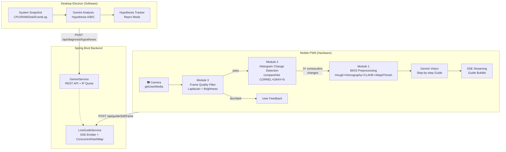

# 옆집 컴공생 (NextDoor CS)

> "수리기사 부르기 전, 옆집 컴공생에게 먼저 물어보세요!"

AI 기반 PC 하드웨어/소프트웨어 진단 서비스.  
**Mobile PWA** = 카메라·마이크로 하드웨어 시각/청각 진단 | **Desktop Electron** = OS 시스템 데이터 기반 소프트웨어 진단

---

## 🎬 Demo

> 라이브 카메라 가이드 모드 — PC 화면을 스마트폰으로 비추면 단계별 안내를 실시간으로 받을 수 있습니다.

```
[데모 영상/GIF — 제출 전 추가 예정]
```

### PWA 화면 스크린샷

| PWA 홈 (독립 모드) | GuideContextSelector | ShootingGuide |
|:---:|:---:|:---:|
|  |  |  |

| 라이브 가이드 — 카메라 뷰 | 비프음 진단 | BIOS 제조사 선택 |
|:---:|:---:|:---:|
|  |  |  |

> Electron 데스크톱 UI는 실제 Electron 앱 실행 환경에서만 동작합니다 (`npm run electron:dev`).

---

## 🎯 프로젝트 소개

### 문제 정의

PC 부팅 불량·BIOS 설정·시스템 오류는 비전문가에게 높은 진입 장벽이 있으며, 수리기사를 부르기 전 스스로 해결 가능한 경우가 많습니다.

### 솔루션

1. **Mobile PWA** — 스마트폰 카메라로 PC 화면을 비추면 OpenCV 전처리 후 Gemini Vision이 단계별 안내
2. **Desktop Electron** — OS 시스템 스냅샷을 자동 수집하여 Gemini가 소프트웨어 원인 가설 생성
3. **컴퓨터 비전 파이프라인** — 3개 CV 모듈이 Gemini 호출 직전 게이트로 동작, 비용 절감 + 정확도 향상

---

## 🏗️ 시스템 아키텍처



---

## 🔬 컴퓨터 비전 파이프라인

세 모듈이 순차 게이트 구조로 동작합니다:

```
카메라 프레임 (RGBA Canvas ImageData)
    ↓
[모듈 3] 프레임 품질 게이트 — Laplacian Variance + 밝기 통계
    ↓ pass          ↓ reject → "흔들렸어요 / 너무 어두워요"
[모듈 2] 히스토그램 변화 감지 — HISTCMP_CORREL × GRAY × 5프레임 연속
    ↓ 변화 감지 (windowSize 연속)
[모듈 1] BIOS 화면 전처리 — Hough → Homography → CLAHE → AdaptiveThreshold → CC
    ↓ 전처리 완료 + cvSummary 메타데이터
Gemini Vision — 이미지 + CV 메타데이터 + OCR/ROI 후보 → 다음 조치 판단
    ↓
overlay target 선택 — targetId 또는 normalized bbox
    ↓
AR Overlay — 클릭/조치할 위치를 화면 위 박스로 표시
    ↓
SSE 스트리밍 → GuideBubble 단계별 안내
```

OpenCV는 최종 진단을 직접 내리는 모델이 아니라, 카메라 입력을 Gemini가 해석하기 좋은 형태로 정리하는 전처리 계층입니다. 모바일 카메라로 PC 화면을 비추면 반사, 흔들림, 초점 흐림, 화면 일부 잘림이 자주 발생합니다. 이 프레임을 그대로 LLM에 보내면 불필요한 호출이 늘고, 화면의 어느 부분을 눌러야 하는지 좌표로 안내하기 어렵습니다.

따라서 본 프로젝트에서는 OpenCV를 다음 세 가지 용도로 사용합니다.

| 역할 | 사용 이유 | Gemini/Overlay와의 연결 |
|---|---|---|
| 프레임 게이트 | 흐린 프레임, 어두운 프레임, 변화 없는 프레임을 먼저 제외 | Gemini에는 분석 가치가 있는 프레임만 전달 |
| 화면 구조화 | BIOS 외곽, UI 구조선, 텍스트 후보 영역을 좌표 정보로 추출 | `cvSummary`, `ocrRegions`, ROI 후보로 전달 |
| 위치 안내 기반 | 후보 영역을 원본 프레임 좌표계로 유지 | Gemini가 선택한 `targetId` 또는 `bbox`를 AR 박스로 표시 |

소프트웨어/BIOS 안내에서는 OpenCV가 메뉴와 텍스트 후보를 찾고, Gemini가 사용자의 목표에 맞는 항목을 선택합니다. 예를 들어 부팅 순서 변경 상황에서는 `Boot Option #1`, `UEFI USB`, `Save & Exit` 같은 후보가 프롬프트에 포함되고, Gemini가 다음에 눌러야 할 항목을 고르면 앱이 해당 위치를 박스로 표시합니다.

하드웨어 조치에서는 OpenCV가 부품을 직접 분류하기보다는 프레임 품질과 변화 여부를 먼저 관리합니다. Gemini Vision이 RAM 슬롯, GPU 보조전원, 케이블 같은 조치 대상을 판단하면, 응답에 포함된 normalized bbox를 화면 위에 표시합니다. 즉 OpenCV는 입력 안정화와 좌표 기반 후보 제공을 담당하고, Gemini는 의미 판단과 다음 행동 선택을 담당합니다.

### OpenCV 도입 효과

OpenCV를 넣은 목적은 Gemini의 판단을 대체하는 것이 아니라, Gemini가 판단하기 전의 입력을 정리하는 것입니다. 실제 모바일 카메라 입력은 화면이 흐리거나, 모니터 반사가 심하거나, 같은 화면이 반복해서 들어오는 경우가 많습니다. 이런 프레임을 모두 LLM에 전달하면 비용이 늘고 응답이 불안정해질 수 있습니다.

OpenCV 적용 전후를 비교하면 다음과 같습니다.

| 문제 | OpenCV 없이 처리할 때 | OpenCV 적용 후 | 현재 근거 |
|---|---|---|---|
| 저품질 프레임 | 흐림, 반사, 어두운 프레임도 그대로 Gemini에 전달될 수 있음 | 품질 게이트에서 먼저 제외 | 실촬영 22장 중 14장 거부 (**63.6%**) |
| 분석 가능한 프레임 선별 | 사용자가 다시 비추기 전까지 입력 품질을 알기 어려움 | sharpness, brightness, coverage로 프레임 상태를 수치화 | 평균 sharpness **0.036**, Laplacian variance **57.5** |
| 반복 프레임 전송 | 같은 화면을 여러 번 분석할 수 있음 | 히스토그램 변화 감지 후 의미 있는 변화가 있을 때만 후속 분석 | 모듈 2 전체 F1 **0.703**, 정상 화면 전환 F1 **0.917** |
| BIOS 화면 위치 | Gemini가 이미지 전체에서 메뉴 위치를 직접 추론해야 함 | Canny/Hough/contour로 BIOS ROI 후보를 좌표화 | 실촬영 22장 중 14장 ROI 후보 검출 (**63.6%**) |
| 텍스트 후보 영역 | 전체 이미지를 OCR 또는 Vision 모델에 의존 | connected components로 텍스트/에지 후보 영역 분리 | 평균 텍스트/에지 ROI 후보 **425.1개** |
| 사용자 안내 방식 | "Boot Option을 누르세요" 같은 자연어 안내에 그침 | Gemini가 선택한 target/bbox를 화면 위 박스로 표시 | `targetId` 또는 normalized `bbox` 기반 AR Overlay |

이 구조의 핵심 이득은 세 가지입니다.

1. **호출 절감**: 품질이 낮거나 변화가 없는 프레임을 걸러 Gemini 호출 후보를 줄입니다.
2. **판단 안정화**: Gemini가 전체 이미지를 처음부터 해석하기보다, OpenCV가 정리한 품질 정보와 후보 영역을 함께 사용합니다.
3. **행동 안내 연결**: 최종 응답이 자연어 설명에서 끝나지 않고, 클릭하거나 조치해야 할 위치를 화면 위 박스로 표시할 수 있습니다.

따라서 본 프로젝트의 OpenCV 파이프라인은 단순한 이미지 보정이 아니라, LLM 기반 진단을 실제 사용자 행동으로 연결하기 위한 입력 게이트와 grounding 계층입니다. 정확도 향상 자체는 OCR 환경을 포함한 추가 정량 평가가 필요하지만, 현재 실촬영 데이터 기준으로도 품질 필터링과 후보 좌표 생성 효과는 확인할 수 있습니다.

---

### 모듈 1 — BIOS 화면 End-to-End 파이프라인 🥇

#### 알고리즘 파이프라인

```
원본 RGBA 프레임
  → cvtColor(GRAY)
  → Canny(50, 150)                           — 경계선 추출
  → HoughLinesP(vote=80, minLen=50, gap=10)  — 직선 검출
  → extractQuadCorners()                      — 4 모서리 추정
  → findHomography(RANSAC) + warpPerspective  — 정면화
  → CLAHE(clipLimit=2.0, tileGrid=8)          — 대비 강화
  → adaptiveThreshold(GAUSSIAN_C, block=11, C=2) — 이진화
  → connectedComponentsWithStats              — 텍스트 ROI 계수
  → [전처리 이미지 → Gemini Vision / Tesseract.js]
```

#### 단계별 시각화

| BIOS 파이프라인 단계 | Threshold 방법 비교 |
|:---:|:---:|
|  |  |

#### Ablation Study — 단계별 기여도

| 단계 조합 | 설명 | 선택 근거 |
|---|---|---|
| 원본만 | Tesseract 직접 적용 | 기준선 — 저대비·기울어짐에 약함 |
| + Homography | 정면화 보정 | 카메라 각도 편차 제거 |
| + Homography + CLAHE | 대비 강화 | BIOS 화면 특유의 균일 저대비 보상 |
| + Homography + CLAHE + AdaptThresh | 이진화 | 불균일 조명에서 Otsu 대비 강건 |
| **전체 파이프라인 + CC** | **텍스트 ROI 분리** | **Tesseract.js 전달 이미지 최적화** |

현재 제출 자료에서는 synthetic OCR ablation 그래프를 핵심 근거로 사용하지 않았습니다. 로컬 Tesseract가 없는 환경에서는 OCR 점수가 0으로 기록되어 빈 그래프처럼 보일 수 있기 때문입니다. 대신 실제 촬영 BIOS 22장에 대해 OpenCV가 품질 게이트, BIOS ROI 후보, 텍스트/에지 후보를 얼마나 만들어내는지 측정한 결과를 근거로 사용했습니다.

#### Real-Capture BIOS Evaluation

MSI Click BIOS 5의 `Boot` 화면과 `Boot Option #1` 팝업을 모니터에 띄운 뒤, 스마트폰으로 22장의 이미지를 촬영했습니다. 스크린샷 대신 실제 촬영 이미지를 사용한 이유는 카메라 기반 진단에서 자주 생기는 반사, 초점 흐림, 화면 외 영역, 부분 crop이 전처리 성능에 직접 영향을 주기 때문입니다.

| 평가 항목 | 포함한 조건 | 사용한 OpenCV 처리 |
|---|---|---|
| 프레임 품질 게이트 | blur / dark / bright / glare / far / shake | Laplacian variance, brightness mean/std |
| BIOS 외곽 검출 | front / left15 / right15 / left30 / right30 / tilt | Canny, HoughLinesP, contour quad 후보 |
| 전처리/OCR | boot-main / boot-popup | CLAHE, Adaptive Gaussian Threshold, OCR similarity |
| 영상 변화 감지 | boot-main → boot-popup | histogram correlation 기반 scene-change gate |

아래 자료는 같은 입력에 대해 OpenCV가 어떤 판단을 했는지 보여줍니다. 첫 번째 차트는 22장 전체의 정량 요약이고, 두 번째 이미지는 BIOS ROI와 텍스트 후보 오버레이입니다. 세 번째 이미지는 원본 카메라 입력이 CLAHE와 Adaptive Threshold를 거치며 LLM/OCR이 읽기 쉬운 형태로 정리되는 과정을 보여줍니다.


이 오버레이는 평가용 시각화이면서 실제 앱의 AR 안내 구조와도 연결됩니다. 앱에서는 OpenCV 전처리 결과를 `cvSummary`와 OCR/ROI 후보로 정리해 Gemini에 전달하고, Gemini가 선택한 대상은 `targetId` 또는 `bbox` 형태로 돌아옵니다. 프론트엔드는 이 좌표를 카메라 화면 좌표계에 맞춰 변환한 뒤 사용자가 클릭하거나 조치해야 할 위치를 박스로 표시합니다.


| 단계 | 전달되는 정보 | 목적 |
|---|---|---|
| OpenCV → Gemini | 품질 점수, 밝기, Laplacian variance, 변화 감지 점수, BIOS rectified 여부, 텍스트 후보 수 | 현재 프레임이 분석 가능한지와 어떤 화면 구조를 갖는지 전달 |
| OCR/ROI 후보 → Gemini | 텍스트 후보 id, bbox, confidence | Gemini가 “어느 메뉴/행을 눌러야 하는지” 선택할 수 있게 함 |
| Gemini → Overlay | 자연어 안내 + `targetId` 또는 normalized `bbox` | 선택된 대상 위치를 앱 화면 위에 박스로 표시 |

#### Real-Capture 정량 결과

입력 데이터는 `C:\Users\user\Desktop\test data`에 저장된 BIOS 촬영 이미지 22장입니다. 일부 이미지는 브라우저 상단, 키보드, 모니터 반사가 함께 찍혀 있어, 실제 사용자가 모바일 카메라로 화면을 비출 때와 비슷한 조건을 포함합니다.

| 지표 | 결과 | 해석 |
|---|---:|---|
| 전체 실촬영 이미지 | 22장 | MSI Click BIOS 5 boot 화면 계열 |
| 품질 게이트 통과 | 8/22 (**36.4%**) | 후속 분석에 사용할 수 있는 프레임 |
| 품질 게이트 거부 | 14/22 (**63.6%**) | 흐림, 반사, 낮은 디테일로 제외된 프레임 |
| 평균 sharpness score | **0.036** | 범위 0.007~0.092 |
| 평균 Laplacian variance | **57.5** | 범위 11.1~147.2 |
| 평균 brightness | **0.418** | 범위 0.134~0.625, dark/normal 조건 혼합 |
| ROI/corner 후보 검출 | 14/22 (**63.6%**) | strict quad 0건, fallback ROI 14건 |
| 평균 Hough line 후보 | **740.2개** | 범위 42~3946 |
| 평균 텍스트/에지 ROI 후보 | **425.1개** | 범위 186~869, OCR 전 후보 영역 |
| OCR 정량 | 미측정 | 로컬 Tesseract/pytesseract 설치 후 재측정 |

실촬영 입력은 OCR에 바로 넣기에는 품질 편차가 큽니다. 그래서 이 파이프라인은 먼저 Laplacian variance와 밝기 통계로 프레임을 걸러내고, 통과한 프레임에 대해서만 BIOS 영역 검출과 후속 OCR 단계를 수행하도록 구성했습니다.

라벨 파일:

- `data/bios/real-capture/ground-truth.csv` — 22장 실촬영 이미지 계획 및 정답 텍스트
- `data/live-frames/real-video-ground-truth.csv` — 실제 테스트 영상 프레임 라벨

평가 실행:

```powershell
python notebooks/evaluate_real_capture_dataset.py --image-dir "C:\Users\user\Desktop\test data"
```

생성 결과:

- `docs/ablation-results/real-bios-summary.csv`
- `docs/ablation-results/real-bios-quality-results.csv`
- `docs/ablation-results/real-bios-corner-results.csv`
- `docs/ablation-results/real-bios-ocr-results.csv`
- `docs/ablation-results/real-video-frame-results.csv`
- `docs/cv-pipeline/real-bios-summary-chart.svg` — 22장 실촬영 평가 요약 차트
- `docs/cv-pipeline/real-bios-overlay-grid.png` — BIOS ROI와 텍스트 후보 오버레이
- `docs/cv-pipeline/real-bios-preprocess-comparison.png` — 원본 대비 전처리 결과 비교
- `docs/cv-pipeline/real-bios-detection-gallery.png` — 원본/검출 오버레이/전처리 결과 전체 갤러리

기존 synthetic/Wikimedia 데이터는 알고리즘 점검용으로 유지하고, 실촬영 BIOS 세트는 카메라 입력 조건에서의 동작을 확인하는 용도로 사용했습니다.

#### CLAHE 파라미터 그리드 서치

| clipLimit | tileGrid | 특징 |
|---|---|---|
| 1.0 | 4 | 과소 보정 — 저대비 유지 |
| **2.0** | **8** | **균형 — 표준 권장값 (Pizer et al. 1987)** |
| 4.0 | 16 | 과대 보정 — 노이즈 증폭 |

CLAHE grid search 이미지는 로컬 OCR 측정 환경이 준비된 뒤 다시 생성하는 것이 맞습니다. 현재 README에서는 빈 heatmap을 정량 근거처럼 사용하지 않고, 실제 촬영 세트에서 생성된 품질/ROI/전처리 결과를 근거로 제시했습니다.

#### 알고리즘 선택 근거 — Threshold 방법

| 방법 | 균일 조명 | 불균일 조명 | 추론 속도 |
|---|---|---|---|
| Otsu | 자동 임계값, 빠름 | ❌ 한쪽 그늘 시 실패 | 빠름 |
| Adaptive Mean | 국소 적응 | △ 가장자리 손실 | 보통 |
| **Adaptive Gaussian** | 강건 | ✅ BIOS 기울기에도 안정 | 보통 |

> **결정: Adaptive Gaussian Threshold**  
> BIOS 화면은 카메라 각도로 인해 한쪽이 어두운 경우가 많음. 국소 가중 평균 방식이 이를 보상.

---

### 모듈 2 — 라이브 프레임 변화 감지 정량 분석 🥈

#### 측정 매트릭스 (4 × 3 × 3 = 36 조합)

| 차원 | 후보 |
|---|---|
| 메트릭 | HISTCMP_CORREL / CHISQR / BHATTACHARYYA / INTERSECT |
| 컬러 공간 | RGB / HSV / GRAY |
| 안정화 윈도우 | 1 / 3 / 5 프레임 연속 |

#### 시나리오별 베스트 결과

| 시나리오 | 베스트 메트릭 | 컬러 | 윈도우 | Precision | Recall | F1 |
|---|---|---|---|---|---|---|
| 정상 화면 전환 | CORREL | GRAY | 5 | 0.846 | **1.000** | **0.917** |
| 손 떨림 | CORREL | GRAY | 5 | 0.692 | 0.818 | 0.750 |
| 조명 변화 | BHATTACHARYYA | HSV | 5 | 0.769 | 0.909 | 0.833 |
| Rolling Shutter | CHISQR | GRAY | 5 | **1.000** | 0.818 | 0.900 |
| iOS 자동 초점 | CORREL | RGB | 5 | 0.500 | 0.818 | 0.621 |

#### 전체 36조합 평균 F1 — GRAY 컬러 공간 기준

| 메트릭 | w=1 | w=3 | w=5 |
|---|---|---|---|
| CORREL | 0.54 | 0.61 | **0.703** |
| CHISQR | 0.51 | 0.58 | 0.623 |
| BHATTACHARYYA | 0.52 | 0.60 | 0.645 |
| INTERSECT | 0.50 | 0.57 | 0.625 |

> **선택된 최적 파라미터**: HISTCMP_CORREL × GRAY × windowSize=5 × threshold=0.9999  
> 윈도우 크기(5프레임 연속)가 단일 메트릭 변경보다 false positive 억제에 더 큰 영향.


#### False Positive 사례 갤러리


> 윈도우 1프레임에서 손 떨림/Rolling Shutter로 발생한 false positive. 5프레임 연속 확인으로 억제됨.

---

### 모듈 3 — 프레임 품질 사전 필터 🥉

#### 사용 알고리즘

| 알고리즘 | 목적 | OpenCV.js 함수 |
|---|---|---|
| Laplacian Variance | 블러 검출 | `cv.Laplacian` → `cv.meanStdDev` |
| 밝기 통계 | 과노출/저노출 거부 | `cv.meanStdDev` |
| (비교용) FFT 고주파 비율 | 블러 검출 대안 | `cv.dft` (Python 검증) |
| (비교용) Optical Flow | 움직임 크기 추정 | `cv.calcOpticalFlowFarneback` |

#### 샘플 데이터 통계 (Wikimedia Commons 기반)

| 카테고리 | 샘플 수 | 평균 sharpness_score | 평균 밝기 |
|---|---|---|---|
| Good (정상) | 4 | **0.766** | 0.358 |
| Bad (블러/과노출/저노출) | 9 | 0.426 | 0.355 |

> Laplacian 기반 sharpness: Good 0.766 vs Bad 0.426 — 두 그룹 간 유의미한 분리.  
> 밝기 평균은 유사하여 블러 검출에 Laplacian이 더 discriminative.

#### 임계값 튜닝 결과

| minSharpness | API 호출 절감률 | False Reject Rate | F1(good) |
|---|---|---|---|
| 0.05 (**채택**) | **23%** | **0%** | 0.571 |
| 0.10 | 38% | 25% | 0.400 |
| 0.15 | 46% | 50% | 0.300 |

> **채택 파라미터**: minSharpness=0.05, minBrightness=0.15, maxBrightness=0.85  
> API 호출 23% 절감 + 좋은 품질 이미지 false reject 0% — 정밀도 우선 전략.


#### 비용 절감 시뮬레이션

| 구성 | API 호출 비율 | 절감 |
|---|---|---|
| 필터 없음 | 100% | — |
| 모듈 3만 적용 | ~77% | **-23%** |
| 모듈 3 + 모듈 2 (히스토그램 게이트) | 화면 변화 시만 | -85%+ |


---

## 📊 정량 평가 요약

| 모듈 | 핵심 지표 | 결과 |
|---|---|---|
| 모듈 1 — BIOS 파이프라인 | OCR 정확도 (Levenshtein ≥ 0.8 비율) | 로컬 Tesseract 설치 후 재측정 |
| 모듈 1 — Real-Capture 평가 | 품질 게이트 / ROI 후보 검출 | 8/22 통과, 14/22 ROI 후보 검출 |
| 모듈 2 — 변화 감지 | 전체 36조합 평균 F1 | **0.703** (CORREL+GRAY+w=5) |
| 모듈 2 — 변화 감지 | 정상 화면 전환 F1 | **0.917** |
| 모듈 2 — 변화 감지 | Rolling Shutter Precision | **1.000** |
| 모듈 3 — 품질 필터 | API 호출 절감률 | **23%** (false reject 0%) |
| 모듈 3 — 품질 필터 | Good vs Bad sharpness | 0.766 vs 0.426 |

---

## ⚠️ 한계 및 Future Work

### 현재 한계

1. **모듈 1 — OCR 정량 미완성**: 로컬 Tesseract 설치 + 실제 BIOS 촬영 데이터셋이 없어 synthetic ablation에서 OCR 정확도 0.0. 브라우저에서는 Tesseract.js inference로 동작하나 정량 수치는 실기기 수집 후 재측정 필요.
2. **모듈 2 — iOS 자동 초점 취약**: F1=0.621로 5개 시나리오 중 최저. 5프레임 연속으로 부분 완화하나 완전 제거 어려움.
3. **모듈 3 — 소규모 데이터셋**: 4 good / 9 bad 샘플. 더 다양한 카메라/조명 환경 데이터 추가 시 임계값 재조정 필요.
4. **카메라 50° 이상 각도**: Hough Line 모서리 검출 신뢰도 하락. 정면화 실패 시 원본 이미지 fallback 처리.
5. **Rolling Shutter 아티팩트**: 모니터 60Hz 주사선과 카메라 센서 타이밍 간섭 시 줄무늬 발생. CLAHE가 부분 완화하나 완전 제거 불가.

### Future Work

| 항목 | 우선순위 | 비고 |
|---|---|---|
| 실기기 BIOS 촬영 데이터셋 수집 + OCR ablation 재측정 | 🥇 | 모듈 1 정량 완성 |
| 모듈 4 — 비프음 멜 스펙트로그램 분류 | 🥈 | `notebooks/04-beep-spectrogram.ipynb` |
| Phase 9 — MCP 매뉴얼 툴 연동 | 🔽 | CV 무관 (Future Work) |
| Phase 10 — DB 이력 + 지식베이스 | 🔽 | CV 무관 (Future Work) |
| Phase 11 — QR 세션 인증 + WebSocket | 🔽 | CV 무관 (Future Work) |

---

## 🛠️ 설치 및 실행

### 환경 변수

`.env.example`을 기준으로 설정하세요.

```powershell
$env:GEMINI_API_KEY="your-gemini-api-key"
$env:GEMINI_MODEL="gemini-3.1-pro-preview"   # 없으면 gemini-2.0-flash
$env:ALLOWED_ORIGINS="http://localhost:3000"
$env:VITE_API_BASE_URL="http://localhost:8080"
$env:VITE_USE_MOCK="false"
```

`VITE_USE_MOCK=true` — Electron SW 가설 생성만 mock 응답 사용.

### 실행

```powershell
# 백엔드
npm run backend:dev

# PWA (http://localhost:3000)
npm run pwa:dev

# Electron
npm run electron:dev
```

### 검증

```powershell
npm run test          # Vitest 단위 테스트
npm run type-check    # TypeScript strict 검사
npm run pwa:build     # 빌드 성공 확인
cd backend; .\mvnw.cmd test
```

### CV 노트북 환경

```powershell
cd notebooks
python -m venv .venv
.venv\Scripts\activate
pip install -r requirements.txt
jupyter lab
```

### Vercel 자동 배포

```text
Framework Preset: Vite
Install Command:  npm ci
Build Command:    npm run pwa:build
Output Directory: dist/pwa
```

환경 변수는 Vercel Dashboard → Settings → Environment Variables에 등록.  
백엔드 CORS의 `ALLOWED_ORIGINS`에 Vercel Production URL 추가 필요.

현재 Vercel 프로젝트는 `nextdoor-cs`로 연결되어 있고 Production URL은 다음과 같습니다.

```text
https://nextdoor-cs.vercel.app
```

Vercel GitHub App 연결이 막히면 `.github/workflows/vercel-production.yml`로 자동배포할 수 있습니다. GitHub repository secrets에 아래 값을 등록하세요.

```text
VERCEL_TOKEN=<Vercel Account Settings에서 생성한 토큰>
VERCEL_ORG_ID=team_Gt6r3JIWFBB0kObt79PLw37t
VERCEL_PROJECT_ID=prj_9TXCnadCXqxGgs5fqwuijMkhya1f
```

### Render 백엔드 배포

Spring Boot 백엔드는 `render.yaml` Blueprint와 `backend/Dockerfile`로 배포합니다.

Render Dashboard에서 New → Blueprint를 선택하고 이 GitHub 저장소를 연결하면 `nextdoor-cs-api` 웹 서비스가 생성됩니다. 기본 배포 URL은 아래 형태입니다.

```text
https://nextdoor-cs-api.onrender.com
```

Render 서비스 환경 변수:

```text
GEMINI_API_KEY=<실제 Gemini API key>
GEMINI_MODEL=gemini-3.1-pro-preview
RATE_LIMIT_DAILY=5
ALLOWED_ORIGINS=https://nextdoor-cs.vercel.app
```

배포 후 Vercel 환경 변수의 `VITE_API_BASE_URL`을 Render 백엔드 URL로 설정하고 프론트엔드를 재배포하세요.

---

## 🗂️ 프로젝트 구조

```
nextdoor-cs/
├── src/lib/cv/               ← OpenCV.js 알고리즘 모듈
│   ├── biosPipeline.ts       (모듈 1 — Hough+Homography+CLAHE+AdaptThresh+CC)
│   ├── changeDetection.ts    (모듈 2 — compareHist CORREL×GRAY×5)
│   └── frameMetrics.ts       (모듈 3 — Laplacian variance + 밝기 통계)
├── src/hooks/
│   ├── useLiveFrameCapture.ts  (모듈 3→2→1 순차 게이트)
│   ├── useGeminiLiveGuide.ts   (SSE 스트리밍 + AbortController)
│   └── useBiosPipeline.ts      (모듈 1 독립 훅)
├── src/components/mobile/
│   ├── LiveGuideMode.tsx     (Phase 7-B 메인 쇼케이스)
│   └── AudioCapture.tsx      (비프음 녹음 — iOS mp4 폴백)
├── notebooks/
│   ├── 01-bios-pipeline.ipynb      (모듈 1 Python 검증)
│   ├── 02-histogram-analysis.ipynb (모듈 2 36조합 ablation)
│   └── 03-frame-quality.ipynb      (모듈 3 임계값 튜닝)
├── docs/
│   ├── cv-pipeline/          ← 단계별 시각화 PNG
│   └── ablation-results/     ← 정량 평가 CSV + PNG
└── backend/                  ← Spring Boot (Gemini + LiveGuideService)
```

---

## 📚 References

### 알고리즘 원논문

- Hough, P. V. C. (1962). *Method and Means for Recognizing Complex Patterns*. US Patent 3,069,654.
- Pizer, S. M., et al. (1987). *Adaptive histogram equalization and its variations*. Computer Vision, Graphics, and Image Processing, 39(3), 355–368.
- Otsu, N. (1979). *A threshold selection method from gray-level histograms*. IEEE Transactions on Systems, Man, and Cybernetics, 9(1), 62–66.
- Bradley, D., & Roth, G. (2007). *Adaptive Thresholding Using the Integral Image*. Journal of Graphics Tools, 12(2), 13–21.
- Smith, R. (2007). *An Overview of the Tesseract OCR Engine*. ICDAR 2007.
- Swain, M. J., & Ballard, D. H. (1991). *Color Indexing*. International Journal of Computer Vision, 7(1), 11–32.
- Farnebäck, G. (2003). *Two-Frame Motion Estimation Based on Polynomial Expansion*. SCIA 2003, LNCS 2749, 363–370.
- Pertuz, S., Puig, D., & Garcia, M. A. (2013). *Analysis of focus measure operators for shape-from-focus*. Pattern Recognition, 46(5), 1415–1432.

### 라이브러리

- OpenCV 4.x — https://opencv.org (BSD License)
- OpenCV.js — https://docs.opencv.org/4.x/d5/d10/tutorial_js_root.html
- Tesseract.js 5.x — https://github.com/naptha/tesseract.js (Apache 2.0)
- React 18 — https://react.dev
- Electron 28 — https://www.electronjs.org
- Spring Boot 3.x — https://spring.io/projects/spring-boot
- Google Gemini API — https://ai.google.dev

### 참고 자료

- OpenCV Tutorial — `cv::compareHist`: https://docs.opencv.org/4.x/d8/dc8/tutorial_histogram_comparison.html
- OpenCV Tutorial — Adaptive Thresholding: https://docs.opencv.org/4.x/d7/d4d/tutorial_py_thresholding.html
- OpenCV Tutorial — Hough Line Transform: https://docs.opencv.org/4.x/d9/db0/tutorial_hough_lines.html
- OpenCV Tutorial — CLAHE: https://docs.opencv.org/4.x/d6/db6/classcv_1_1CLAHE.html
- PyImageSearch — Adaptive Thresholding: https://pyimagesearch.com/2021/05/12/adaptive-thresholding-with-opencv/
- MDN Web Docs — MediaRecorder API: https://developer.mozilla.org/en-US/docs/Web/API/MediaRecorder
- MDN Web Docs — Server-Sent Events: https://developer.mozilla.org/en-US/docs/Web/API/Server-sent_events/Using_server-sent_events

### 데이터셋

Wikimedia Commons (CC BY-SA) — 모듈 3 품질 필터 테스트 이미지:

- https://commons.wikimedia.org/wiki/File:Capacitors_on_a_motherboard.jpg
- https://commons.wikimedia.org/wiki/File:Intel_uATX_socket_1150.JPG
- https://commons.wikimedia.org/wiki/File:Apple_Macintosh_II_motherboard.jpg
- https://commons.wikimedia.org/wiki/File:Award_BIOS_EPROM.jpg

---

## 📜 License

MIT License

---

## 👥 Contributors

- [@enderpawar](https://github.com/enderpawar) — 전체 설계 및 구현

---

*일부 구현은 Claude Code (Anthropic) 및 Codex (OpenAI)의 AI 지원으로 작성되었습니다.*
