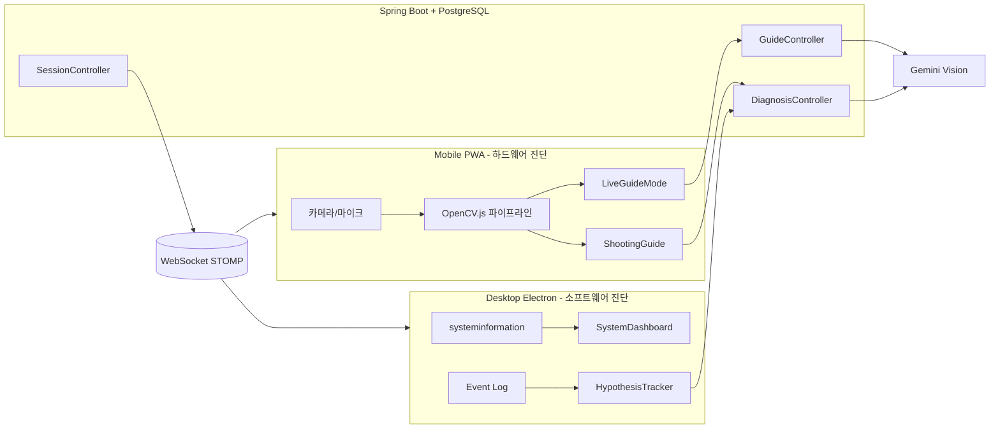
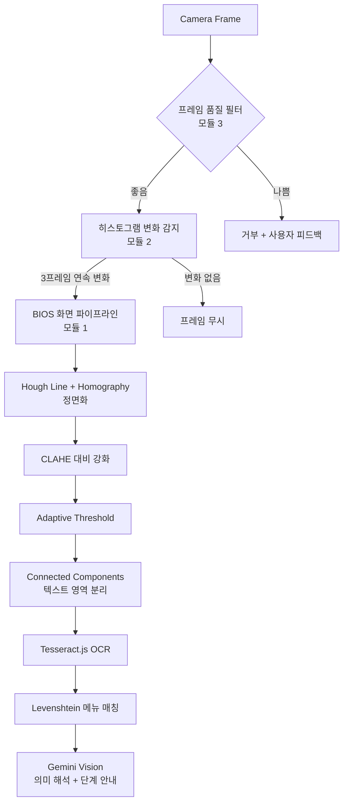

# 시스템 아키텍처

> README에 임베드할 시스템 다이어그램 + 컴포넌트 설명.
> Mermaid는 GitHub에서 직접 렌더링됨.

## 전체 시스템

## CV 파이프라인 (Phase 7-B 라이브 가이드)

## 컴포넌트 책임 분리

| 레이어 | 책임 | 사용 기술 |
|---|---|---|
| **OpenCV.js (브라우저)** | 변화 감지·전처리·정면화·OCR 전처리 | Hough, Homography, CLAHE, Threshold |
| **Tesseract.js** | 텍스트 추출 | LSTM 기반 OCR (학습된 모델 사용, finetune 없음) |
| **Gemini Vision** | 의미 해석 + 자연어 안내 생성 | Multimodal LLM |
| **Spring Boot** | SSE 스트리밍 + 세션 관리 + Gemini 프록시 | SseEmitter |
| **PostgreSQL** | 진단 이력 + 세션 (Phase 10) | JPA |

> **CV 모듈은 클래식 OpenCV만 사용** (딥러닝 학습 없음).
> Tesseract.js는 사전 학습된 모델을 inference만 — 학습 작업 없음.
